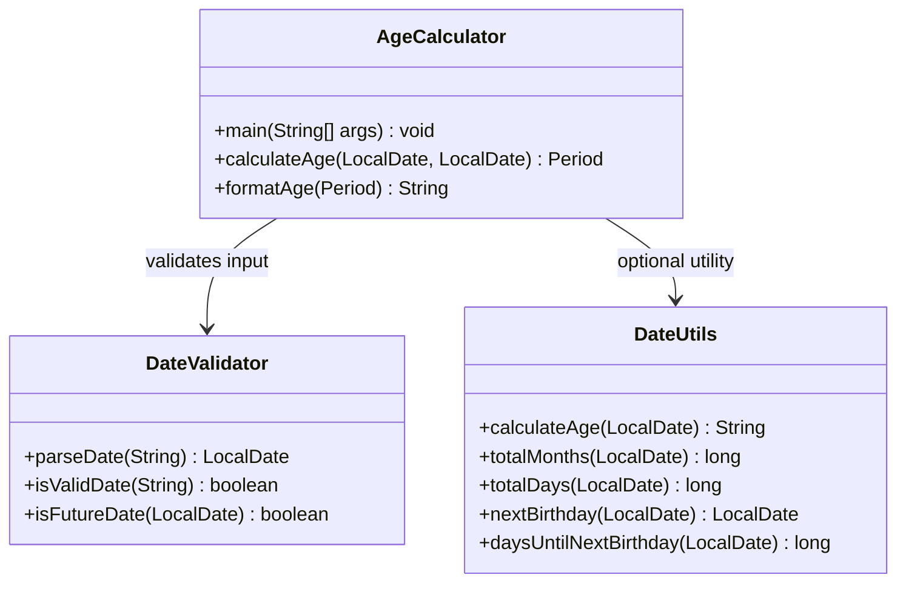
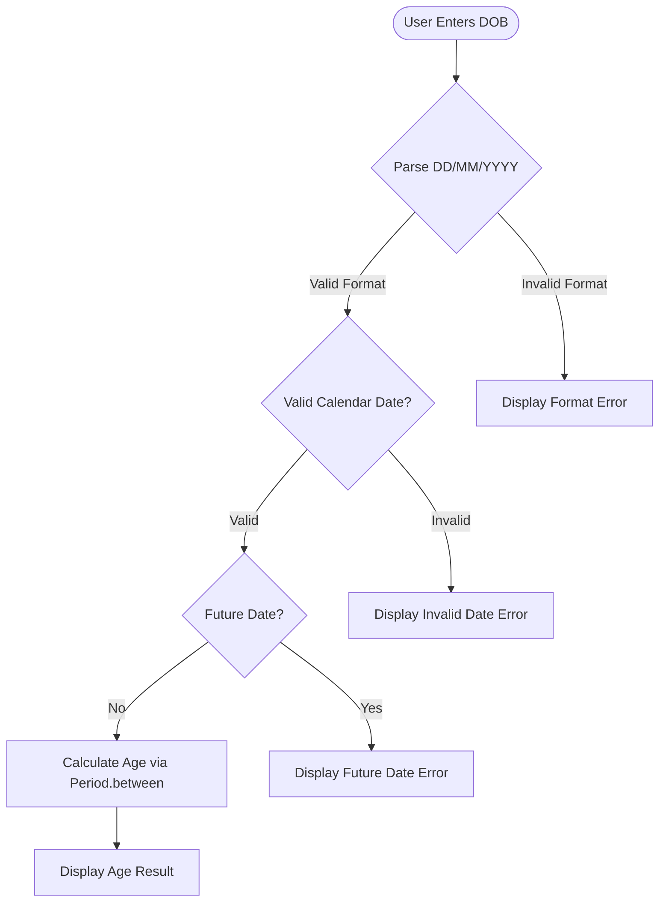
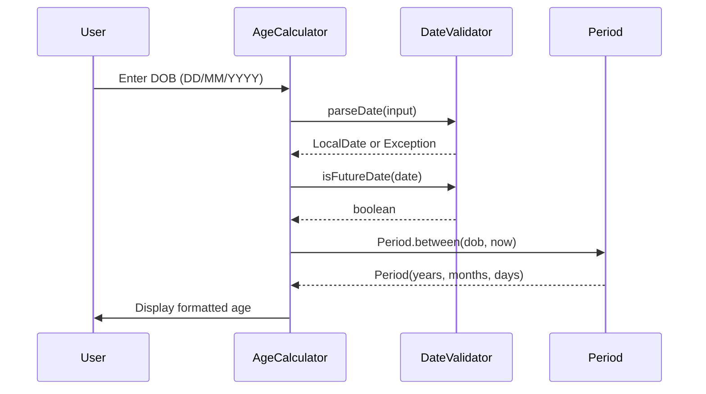

# Technical Specification

# 0. Agent Action Plan

## 0.1 Intent Clarification

### 0.1.1 Core Documentation Objective

Based on the provided requirements, the Blitzy platform understands that the documentation objective is to **create comprehensive new project documentation** for a Java-based Age Calculator application that computes a user's exact age in years, months, and days from their Date of Birth (DOB). The repository is currently a greenfield project containing only a placeholder `README.md` file with the heading "13feb_1" and no source code, build configuration, or existing documentation infrastructure.

- **Documentation Category:** Create new documentation (greenfield project)
- **Documentation Types Required:**
  - README file (project overview, setup, usage, and build instructions)
  - API / Code reference documentation (Javadoc for all public classes and methods)
  - Technical specification documentation (architecture, design decisions, and class relationships)
  - Test case documentation (test scenarios, expected results, and coverage)
  - User guide documentation (input format, output format, error handling, and examples)
  - Optional enhancement documentation (GUI, utility class, and birthday countdown features)

- **Documented Requirements with Enhanced Clarity:**
  - The application must accept Date of Birth input in **DD/MM/YYYY** format and calculate the exact age using `java.time.LocalDate`, `java.time.Period`, and `java.time.format.DateTimeFormatter`
  - Output must follow the exact format: `Your age is X years, Y months, and Z days.`
  - Input validation must reject future dates, invalid calendar dates (e.g., 31/02/2020), and malformed input with meaningful error messages
  - The application must follow Object-Oriented Programming principles with proper `try-catch` exception handling
  - Leap year dates (e.g., 29/02/2000) must be handled correctly
  - Optional enhancements include: total age in months/days, countdown to next birthday, Java Swing/JavaFX GUI, and a reusable utility class

- **Implicit Documentation Needs:**
  - Since this is a greenfield project, a complete project structure guide is needed so developers can understand the directory layout
  - Javadoc comments must be documented for the main `AgeCalculator` class and any utility classes
  - Build and compilation instructions are required (the project uses standard `javac` compilation with no build tool specified)
  - Error handling documentation covering all edge cases (future dates, invalid formats, non-existent dates)

### 0.1.2 Special Instructions and Constraints

- **No user-provided templates or style guides** were supplied; documentation will follow standard Java project documentation conventions using Javadoc and Markdown
- **No design system** is specified; this is a backend CLI application with no UI component in the core scope
- **No build tool** (Maven, Gradle) is specified; the project uses direct `javac` compilation
- **User Example — Sample Input/Output (preserved exactly as provided):**

User Example:
```plaintext
Enter your Date of Birth (DD/MM/YYYY): 15/08/1998
```

User Example:
```plaintext
Your age is 27 years, 6 months, and 15 days.
```

- **User Example — Test Cases (preserved exactly as provided):**
  - ✅ Normal DOB (e.g., 15/08/1998)
  - ✅ Leap year DOB (29/02/2000)
  - ❌ Invalid date (31/02/2020)
  - ❌ Future date
  - ❌ Wrong format input

- **Style Preferences:** Clean, readable, and educational documentation tone suitable for developers, students, and interview preparation contexts
- **Web search requirements:** Java documentation best practices, Javadoc conventions, and `java.time` API usage patterns were researched

### 0.1.3 Technical Interpretation

These documentation requirements translate to the following technical documentation strategy:

- To document the **core application logic**, we will create a comprehensive `README.md` with project overview, setup instructions, compilation commands, usage examples, and architecture overview
- To document the **public API surface**, we will create Javadoc reference documentation for all public classes (`AgeCalculator`, `DateValidator`, and optional `DateUtils` utility class) covering method signatures, parameters, return types, and exceptions
- To document the **test coverage**, we will create a dedicated test documentation file mapping each test case (normal DOB, leap year, invalid date, future date, wrong format) to specific validation logic and expected outcomes
- To document the **project architecture**, we will create an architecture overview with Mermaid class diagrams showing the relationships between the main class, validator, and utility components
- To document the **optional enhancements**, we will create a separate enhancements guide describing the GUI approach (Swing/JavaFX), utility class pattern, and birthday countdown feature

### 0.1.4 Inferred Documentation Needs

- Based on the greenfield repository state: The project requires a complete documentation scaffold from scratch, including `README.md`, `docs/` directory structure, and inline Javadoc
- Based on the user's mention of "Interview-ready version" and "Mini project documentation": The documentation must be structured to serve as a portfolio-quality reference with clear explanations suitable for technical interviews
- Based on the `java.time` API requirements: Documentation must include API reference material for `LocalDate`, `Period`, and `DateTimeFormatter` usage patterns within the project context
- Based on the test case list: A formal test matrix document is needed mapping each scenario to its expected behavior, validation rule, and error message
- Based on the optional GUI enhancement: Documentation should include a section on how to extend the console application to a Swing/JavaFX GUI with architectural guidance

## 0.2 Documentation Discovery and Analysis

### 0.2.1 Existing Documentation Infrastructure Assessment

Repository analysis reveals a **completely empty documentation infrastructure** with no existing documentation framework, generator, or content beyond a single placeholder file. The repository is a greenfield project with no source code, build configurations, or documentation tooling.

- **Repository State:** The root directory contains only `README.md` — a single-line file with the content `# 13feb_1` serving as a namespace marker
- **Documentation Files Found:** None (no `docs/` directory, no `*.md` files beyond the placeholder README, no `*.rst`, `*.mdx`, or wiki content)
- **Documentation Generators:** None detected (no `mkdocs.yml`, `docusaurus.config.js`, `sphinx/conf.py`, `javadoc` configuration, or `.readthedocs.yml`)
- **API Documentation Tools:** None configured (no Javadoc plugin configuration, no Swagger/OpenAPI specs)
- **Diagram Tools:** None present (Mermaid diagrams will be used inline in Markdown as the default)
- **Documentation Hosting/Deployment:** Not configured

**Search Patterns Employed:**
- Root folder contents retrieved via `get_source_folder_contents("")` — confirmed single `README.md` file
- `README.md` file content read via `read_file` — confirmed placeholder content `# 13feb_1`
- No `.blitzyignore` files found in the repository
- No `/tmp/environments_files/` content found

**Current Documentation Framework:** None — documentation will be created from scratch using Markdown with Mermaid diagrams and Javadoc for inline code documentation.

### 0.2.2 Repository Code Analysis for Documentation

Since the repository is a greenfield project with no existing source code, the documentation plan is derived entirely from the user's functional and technical requirements specification:

- **Public APIs to Document (from user requirements):**
  - Main class with `main(String[] args)` entry point accepting console input
  - Age calculation method using `Period.between(birthDate, currentDate)`
  - Date validation methods for format checking, future date rejection, and invalid date detection
  - Date parsing using `DateTimeFormatter` with `DD/MM/YYYY` pattern

- **Module Interfaces to Document:**
  - `AgeCalculator` — Main application class with console I/O
  - `DateValidator` (inferred) — Input validation utility
  - `DateUtils` (optional enhancement) — Reusable age calculation utility class

- **Configuration Options:** None — the application is a standalone Java console application with no external configuration

- **CLI Commands to Document:**
  - `javac AgeCalculator.java` — Compilation command
  - `java AgeCalculator` — Execution command

- **Key Directories to Be Created and Documented:**
  - `src/` — Java source files
  - `docs/` — Project documentation
  - `tests/` — Test case documentation and examples

- **Related Documentation Found:** No existing documentation exists; all documentation is new creation

### 0.2.3 Web Search Research Conducted

- **Java documentation best practices:** Javadoc is the standard tool for generating API documentation from Java source code comments, using `/** */` comment blocks with tags such as `@param`, `@return`, `@throws`, `@since`, and `@author`
- **Age calculation patterns in Java:** The `java.time.Period.between()` method combined with `LocalDate` is the idiomatic Java 8+ approach for calculating age in years, months, and days — this is the exact pattern specified by the user
- **Documentation structure conventions:** Java projects typically include a `README.md` at root level, Javadoc comments in source files, and a `docs/` directory for extended documentation
- **Recommended diagram types:** Class diagrams (for OOP structure), flowcharts (for validation logic), and sequence diagrams (for user interaction flow) using Mermaid syntax embedded in Markdown

## 0.3 Documentation Scope Analysis

### 0.3.1 Code-to-Documentation Mapping

Since this is a greenfield project, the documentation scope is derived from the user's specification rather than existing code. All modules, classes, and methods listed below will be created alongside their documentation.

- **Module: `AgeCalculator.java` (Main Application Class)**
  - Public APIs:
    - `public static void main(String[] args)` — Application entry point, handles console I/O
    - `public static Period calculateAge(LocalDate birthDate, LocalDate currentDate)` — Core age calculation logic
    - `public static String formatAge(Period age)` — Formats the Period into the user-specified output string
  - Current documentation: Missing (class does not exist yet)
  - Documentation needed: Javadoc comments, API reference, usage examples, class-level overview

- **Module: `DateValidator.java` (Input Validation Class — inferred)**
  - Public APIs:
    - `public static LocalDate parseDate(String input)` — Parses DD/MM/YYYY input to LocalDate
    - `public static boolean isValidDate(String input)` — Validates date format and calendar validity
    - `public static boolean isFutureDate(LocalDate date)` — Checks if date is in the future
  - Current documentation: Missing (class does not exist yet)
  - Documentation needed: Javadoc comments, validation rules reference, error message catalog

- **Module: `DateUtils.java` (Optional Reusable Utility Class)**
  - Public APIs:
    - `public static String calculateAge(LocalDate birthDate)` — Simplified utility method
    - `public static long totalMonths(LocalDate birthDate)` — Total age in months
    - `public static long totalDays(LocalDate birthDate)` — Total age in days
    - `public static LocalDate nextBirthday(LocalDate birthDate)` — Calculates next birthday date
    - `public static long daysUntilNextBirthday(LocalDate birthDate)` — Countdown to next birthday
  - Current documentation: Missing (class does not exist yet)
  - Documentation needed: Javadoc comments, API reference, reusable usage patterns

- **Configuration Options Requiring Documentation:** None — standalone Java application with no external configuration files

- **Features Requiring User Guides:**
  - Feature: **Age Calculation from DOB**
    - Current coverage: None (greenfield)
    - Gaps: Complete user guide needed covering input format, output format, error handling, and examples
  - Feature: **Input Validation**
    - Current coverage: None
    - Gaps: Error message catalog, validation rules, and edge case documentation
  - Feature: **Optional GUI Enhancement**
    - Current coverage: None
    - Gaps: Swing/JavaFX setup guide, GUI architecture, and event handling documentation

### 0.3.2 Documentation Gap Analysis

Given the requirements and repository analysis, the documentation gaps encompass the entire project since no documentation currently exists:

- **Undocumented Public APIs:** All classes and methods (AgeCalculator, DateValidator, DateUtils) — 100% of the API surface is undocumented
- **Missing User Guides:**
  - Getting Started guide (installation, compilation, execution)
  - Usage guide (input format, output format, interactive usage)
  - Error handling guide (all error scenarios and their messages)
  - Test case guide (how to verify correctness)
- **Incomplete Architecture Documentation:**
  - Class diagram showing OOP relationships
  - Flowchart for validation and calculation logic
  - Data flow from user input to age output
- **Outdated Documentation:**
  - `README.md` contains only a placeholder heading `# 13feb_1` — requires complete rewrite with project documentation
- **Missing Documentation Assets:**
  - No Javadoc configuration or output
  - No Mermaid diagrams for architectural visualization
  - No test matrix document
  - No contribution or development guide

## 0.4 Documentation Implementation Design

### 0.4.1 Documentation Structure Planning

The following documentation hierarchy will be created for the Age Calculator project:

```
age-calculator/
├── README.md                          (Project overview, quick start, and usage)
├── docs/
│   ├── getting-started/
│   │   ├── installation.md            (JDK setup and compilation)
│   │   └── usage.md                   (Input format, running the app, examples)
│   ├── api-reference/
│   │   ├── age-calculator.md          (AgeCalculator class API docs)
│   │   ├── date-validator.md          (DateValidator class API docs)
│   │   └── date-utils.md             (DateUtils utility class API docs)
│   ├── architecture/
│   │   └── overview.md                (Class diagrams, data flow, design decisions)
│   ├── testing/
│   │   └── test-cases.md             (Test matrix, scenarios, expected results)
│   └── enhancements/
│       └── optional-features.md       (GUI, utility class, birthday countdown)
└── src/
    └── *.java                         (Source files with inline Javadoc comments)
```

### 0.4.2 Content Generation Strategy

**Information Extraction Approach:**
- "Extract API signatures from the user's functional and technical requirements specification to define all public methods, parameters, return types, and exceptions"
- "Generate code examples based on the user-provided sample input/output and test cases"
- "Create architecture diagrams by mapping the OOP class relationships between AgeCalculator, DateValidator, and DateUtils"
- "Derive error handling documentation from the validation requirements (future dates, invalid dates, wrong format)"

**Documentation Standards:**
- Markdown formatting with proper headers (`#`, `##`, `###`) for all documentation files
- Mermaid diagram integration using fenced code blocks for class diagrams and flowcharts
- Code examples using `java` language-tagged fenced code blocks with syntax highlighting
- Source citations as inline references: `Source: src/AgeCalculator.java`
- Tables for method parameter descriptions, return values, and exception types
- Consistent terminology: "Date of Birth" (not "DOB" or "birthday"), "age calculation" (not "age computation")

**Template Application:**
- No user-provided templates exist; all documentation will follow standard Markdown conventions
- API reference documents will use a consistent structure: Overview → Methods → Parameters → Return Values → Exceptions → Examples
- User guides will follow a progressive disclosure pattern: simple usage → advanced usage → troubleshooting

### 0.4.3 Diagram and Visual Strategy

**Mermaid Diagrams to Create:**

- **Class Diagram** — Showing the OOP structure of AgeCalculator, DateValidator, and DateUtils with their methods and relationships:



- **Flowchart** — Illustrating the input validation and age calculation workflow:



- **Sequence Diagram** — Depicting the user interaction flow from input to output:



## 0.5 Documentation File Transformation Mapping

### 0.5.1 File-by-File Documentation Plan

The following table maps every documentation file to be created or updated, with target file listed first:

| Target Documentation File | Transformation | Source Code/Docs | Content/Changes |
|---------------------------|----------------|------------------|-----------------|
| README.md | UPDATE | README.md | Complete rewrite: project title, description, features, prerequisites (JDK 8+), compilation instructions, usage examples with sample input/output, test case summary, project structure overview, optional enhancements summary, and license |
| docs/getting-started/installation.md | CREATE | User requirements (Technical Requirements section) | JDK installation guide, environment variable setup (JAVA_HOME, PATH), verifying Java version, compiling the project with `javac`, and running with `java` |
| docs/getting-started/usage.md | CREATE | User requirements (Functional Requirements + Sample I/O) | Step-by-step usage guide: launching the application, entering DOB in DD/MM/YYYY format, interpreting output, handling error messages, and re-running with different inputs |
| docs/api-reference/age-calculator.md | CREATE | src/AgeCalculator.java | Complete API reference for AgeCalculator class: class overview, `main()` method documentation, `calculateAge()` method with `@param birthDate`, `@param currentDate`, `@return Period`, `formatAge()` method, exception handling, and usage examples |
| docs/api-reference/date-validator.md | CREATE | src/DateValidator.java | Complete API reference for DateValidator class: `parseDate()` with DD/MM/YYYY format handling, `isValidDate()` validation rules, `isFutureDate()` check, `@throws DateTimeParseException`, and error message catalog |
| docs/api-reference/date-utils.md | CREATE | src/DateUtils.java | API reference for optional DateUtils utility: `calculateAge()`, `totalMonths()`, `totalDays()`, `nextBirthday()`, `daysUntilNextBirthday()`, reusable method patterns, and integration examples |
| docs/architecture/overview.md | CREATE | src/*.java | Architecture documentation: OOP class diagram (Mermaid), data flow from input to output, design decisions (why `java.time` over legacy `Date`), class responsibility descriptions, and validation pipeline diagram |
| docs/testing/test-cases.md | CREATE | User requirements (Test Cases section) | Test matrix document: 5 core test scenarios (normal DOB, leap year, invalid date, future date, wrong format), expected inputs, expected outputs, expected error messages, and pass/fail criteria |
| docs/enhancements/optional-features.md | CREATE | User requirements (Optional Enhancements section) | Enhancement guide: total age in months/days approach, birthday countdown algorithm, Java Swing/JavaFX GUI setup, utility class pattern for reuse, and architectural guidance for each enhancement |

### 0.5.2 New Documentation Files Detail

**File: README.md (UPDATE — Complete Rewrite)**
- Type: Project Overview and Quick Start
- Source: User requirements specification
- Sections:
  - Project Title and Description
  - Features List (age calculation, input validation, leap year handling)
  - Prerequisites (JDK 8 or higher)
  - Quick Start (compile and run commands)
  - Usage Examples (sample input/output as provided by user)
  - Test Cases Summary (5 scenarios table)
  - Project Structure (directory tree)
  - Optional Enhancements (brief descriptions)
  - License and Author Information
- Diagrams: None (text-focused quick reference)
- Key Citations: User requirements, src/AgeCalculator.java

**File: docs/getting-started/installation.md**
- Type: Setup Guide
- Source: Technical requirements specification
- Sections:
  - Prerequisites (JDK 8+ with `java.time` API)
  - Installing JDK (brief platform-agnostic guidance)
  - Verifying Installation (`java --version`)
  - Compiling the Project (`javac src/*.java`)
  - Running the Application (`java -cp src AgeCalculator`)
- Diagrams: None
- Key Citations: User technical requirements

**File: docs/getting-started/usage.md**
- Type: User Guide
- Source: Functional requirements, sample input/output
- Sections:
  - Launching the Application
  - Input Format (DD/MM/YYYY with examples)
  - Understanding Output (years, months, days breakdown)
  - Error Messages Reference (format errors, invalid dates, future dates)
  - Tips and Best Practices
- Diagrams: Flowchart of user interaction
- Key Citations: User functional requirements, user sample I/O

**File: docs/api-reference/age-calculator.md**
- Type: API Reference
- Source: src/AgeCalculator.java
- Sections:
  - Class Overview (purpose and capabilities)
  - Method: `main(String[] args)` — entry point documentation
  - Method: `calculateAge(LocalDate birthDate, LocalDate currentDate)` — core logic
  - Method: `formatAge(Period age)` — output formatting
  - Exception Handling (DateTimeParseException, DateTimeException)
  - Examples (from user-provided test cases)
- Diagrams: Class diagram excerpt for AgeCalculator
- Key Citations: src/AgeCalculator.java, java.time.Period, java.time.LocalDate

**File: docs/api-reference/date-validator.md**
- Type: API Reference
- Source: src/DateValidator.java
- Sections:
  - Class Overview (input validation responsibilities)
  - Method: `parseDate(String input)` — DD/MM/YYYY parsing
  - Method: `isValidDate(String input)` — format and calendar validation
  - Method: `isFutureDate(LocalDate date)` — future date rejection
  - Error Message Catalog (table of all error messages)
  - Validation Rules (format regex, calendar validity, temporal constraints)
- Diagrams: Validation flowchart
- Key Citations: src/DateValidator.java, java.time.format.DateTimeFormatter

**File: docs/api-reference/date-utils.md**
- Type: API Reference
- Source: src/DateUtils.java (optional enhancement)
- Sections:
  - Class Overview (reusable utility for age operations)
  - Method: `calculateAge(LocalDate birthDate)` — simplified calculation
  - Method: `totalMonths(LocalDate birthDate)` — total months
  - Method: `totalDays(LocalDate birthDate)` — total days
  - Method: `nextBirthday(LocalDate birthDate)` — next birthday date
  - Method: `daysUntilNextBirthday(LocalDate birthDate)` — countdown
  - Integration Examples (how to import and use in other projects)
- Diagrams: None
- Key Citations: src/DateUtils.java, java.time.temporal.ChronoUnit

**File: docs/architecture/overview.md**
- Type: Architecture Documentation
- Source: All source files, user requirements
- Sections:
  - System Overview (single-application architecture)
  - Class Diagram (Mermaid — AgeCalculator, DateValidator, DateUtils relationships)
  - Data Flow (input parsing → validation → calculation → formatting → output)
  - Design Decisions (java.time API selection, OOP principles, separation of concerns)
  - Error Handling Architecture (try-catch strategy, exception propagation)
- Diagrams: Class diagram, data flow diagram, validation flowchart
- Key Citations: All src/*.java files

**File: docs/testing/test-cases.md**
- Type: Test Documentation
- Source: User requirements (Test Cases section)
- Sections:
  - Test Strategy Overview
  - Test Case Matrix (5 scenarios with inputs, expected outputs, and verdicts)
  - Normal Date Test Scenarios (15/08/1998 and other standard dates)
  - Leap Year Test Scenarios (29/02/2000)
  - Invalid Date Test Scenarios (31/02/2020)
  - Future Date Test Scenarios (dates after current date)
  - Wrong Format Test Scenarios (non-DD/MM/YYYY inputs)
  - Edge Cases (01/01/0001, same-day birthday, yesterday's date)
- Diagrams: None
- Key Citations: User test case requirements

**File: docs/enhancements/optional-features.md**
- Type: Enhancement Guide
- Source: User requirements (Optional Enhancements section)
- Sections:
  - Total Age in Months and Days (using `ChronoUnit.MONTHS`, `ChronoUnit.DAYS`)
  - Birthday Countdown Feature (calculating next birthday date and days remaining)
  - Java Swing GUI (basic form with input field, button, and result label)
  - JavaFX GUI Alternative (modern approach with FXML)
  - Reusable Utility Class Pattern (extracting logic into `DateUtils`)
  - Architecture Guidance (how each enhancement modifies the class structure)
- Diagrams: Updated class diagram showing GUI components
- Key Citations: User optional enhancement requirements

### 0.5.3 Documentation Configuration Updates

Since no documentation framework exists, no configuration files require updates. The documentation is authored in pure Markdown with Mermaid diagrams and does not depend on any documentation generator or build tool.

- **mkdocs.yml:** Not applicable — no MkDocs in use
- **docusaurus.config.js:** Not applicable — no Docusaurus in use
- **.readthedocs.yml:** Not applicable — no ReadTheDocs in use
- **package.json:** Not applicable — no Node.js tooling in use

### 0.5.4 Cross-Documentation Dependencies

- **Shared Content:** The README.md will reference all documents under `docs/` via relative Markdown links
- **Navigation Links:**
  - README.md → docs/getting-started/installation.md → docs/getting-started/usage.md
  - README.md → docs/api-reference/age-calculator.md
  - docs/architecture/overview.md ↔ docs/api-reference/*.md (bidirectional class references)
  - docs/testing/test-cases.md → docs/getting-started/usage.md (error message cross-reference)
  - docs/enhancements/optional-features.md → docs/api-reference/date-utils.md
- **Table of Contents:** README.md will include a table of contents linking to all documentation sections
- **Index/Glossary:** Not required for this project scope; key terms (LocalDate, Period, DateTimeFormatter) are defined inline where used

## 0.6 Dependency Inventory

### 0.6.1 Documentation Dependencies

The Age Calculator project is a pure Java console application with no external build tools or documentation generators. All documentation is authored in Markdown with Mermaid diagrams rendered natively by platforms such as GitHub, GitLab, and VS Code.

| Registry | Package Name | Version | Purpose |
|----------|--------------|---------|---------|
| JDK | java.time.LocalDate | JDK 8+ | Core date representation for DOB and current date |
| JDK | java.time.Period | JDK 8+ | Age calculation in years, months, and days |
| JDK | java.time.format.DateTimeFormatter | JDK 8+ | Parsing DD/MM/YYYY date input format |
| JDK | java.util.Scanner | JDK 1.0+ | Console input reading for interactive DOB entry |
| Javadoc | javadoc | JDK 8+ | API documentation generation from source comments |
| Markdown | Mermaid (inline) | N/A | Class diagrams and flowcharts embedded in Markdown |

**Notes:**
- No external dependencies (Maven/Gradle packages) are required — the project uses only the Java Standard Library
- The `java.time` package was introduced in Java 8 (JSR-310); JDK 8 is the minimum supported version
- Javadoc is bundled with the JDK and requires no separate installation
- Mermaid diagrams are rendered by GitHub/GitLab Markdown processors and do not require a local installation for documentation viewing
- The user specified `java.time.LocalDate`, `java.time.Period`, and `java.time.format.DateTimeFormatter` as the required APIs; these are all part of the Java Standard Library and do not require any third-party dependencies

### 0.6.2 Documentation Reference Updates

Since this is a greenfield project, no existing documentation links require migration or transformation. All documentation links will be created fresh:

- **Internal Link Convention:**
  - From README.md: `[Installation Guide](docs/getting-started/installation.md)`
  - From README.md: `[Usage Guide](docs/getting-started/usage.md)`
  - From README.md: `[API Reference](docs/api-reference/age-calculator.md)`
  - From README.md: `[Architecture](docs/architecture/overview.md)`
  - From README.md: `[Test Cases](docs/testing/test-cases.md)`
  - From README.md: `[Optional Enhancements](docs/enhancements/optional-features.md)`

- **Cross-reference Convention:**
  - API docs to architecture: `See [Architecture Overview](../architecture/overview.md)`
  - Test docs to usage: `See [Usage Guide](../getting-started/usage.md) for error message details`
  - Enhancement docs to API: `See [DateUtils API](../api-reference/date-utils.md)`

## 0.7 Coverage and Quality Targets

### 0.7.1 Documentation Coverage Metrics

**Current Coverage Analysis:**
- Public APIs documented: 0/11 (0%) — No source code or Javadoc exists
- User-facing features documented: 0/3 (0%) — No user guides for age calculation, validation, or enhancements
- Configuration options documented: N/A — No configuration options in the application

**Target Coverage:** 100% of all public classes, methods, and user-facing features must be documented.

**Coverage Gaps to Address:**

| Area | Current | Target | Gap |
|------|---------|--------|-----|
| AgeCalculator class methods | 0% | 100% | 3 public methods require full Javadoc and API reference |
| DateValidator class methods | 0% | 100% | 3 public methods require full Javadoc and API reference |
| DateUtils class methods (optional) | 0% | 100% | 5 public methods require full Javadoc and API reference |
| User guide (installation) | 0% | 100% | Complete installation guide from scratch |
| User guide (usage) | 0% | 100% | Complete usage guide with examples and error handling |
| Architecture documentation | 0% | 100% | Class diagrams, data flow, and design decisions |
| Test case documentation | 0% | 100% | 5+ test scenarios with expected results |
| Enhancement documentation | 0% | 100% | 4 optional features documented |
| README project overview | 5% | 100% | Placeholder heading needs full rewrite |

### 0.7.2 Documentation Quality Criteria

**Completeness Requirements:**
- All public methods have descriptions, `@param` tags for each parameter, `@return` descriptions, and `@throws` for each declared exception
- All user guides include setup prerequisites, step-by-step instructions, and troubleshooting for common errors
- All architecture documentation includes at least one Mermaid diagram and design rationale
- The README includes compilation commands, usage examples, and the complete project structure

**Accuracy Validation:**
- Code examples must match the exact API signatures defined in the requirements (`java.time.LocalDate`, `java.time.Period`, `java.time.format.DateTimeFormatter`)
- Input/output examples must reflect the user-specified format: input as `DD/MM/YYYY` and output as `Your age is X years, Y months, and Z days.`
- Test case documentation must match the 5 scenarios specified by the user: normal DOB, leap year DOB, invalid date, future date, wrong format

**Clarity Standards:**
- Technical accuracy with accessible language suitable for students and interview preparation
- Progressive disclosure: README (quick start) → Getting Started (detailed setup) → API Reference (method-level detail)
- Consistent terminology: "Date of Birth" used throughout; "age" always means years + months + days
- Error messages documented with exact text and resolution steps

**Maintainability:**
- Source citations linking documentation to specific source files and line numbers
- Modular documentation structure allowing individual files to be updated independently
- Markdown format ensures portability across GitHub, GitLab, Bitbucket, and local editors

### 0.7.3 Example and Diagram Requirements

- **Minimum Examples Per API Method:** 2 (one normal usage, one edge case)
- **Diagram Types Required:**
  - 1 class diagram (OOP structure of all classes)
  - 1 flowchart (validation and calculation logic)
  - 1 sequence diagram (user interaction flow)
- **Code Example Validation:** All code examples must use the correct `java.time` API calls and compile with JDK 8+
- **Visual Content:** Mermaid diagrams embedded in Markdown; no external image files required

## 0.8 Scope Boundaries

### 0.8.1 Exhaustively In Scope

**New Documentation Files:**
- `README.md` — Complete rewrite of the project overview and quick start guide
- `docs/getting-started/installation.md` — JDK setup and compilation guide
- `docs/getting-started/usage.md` — Application usage guide with examples
- `docs/api-reference/age-calculator.md` — AgeCalculator class API reference
- `docs/api-reference/date-validator.md` — DateValidator class API reference
- `docs/api-reference/date-utils.md` — DateUtils utility class API reference (optional enhancement)
- `docs/architecture/overview.md` — Architecture documentation with diagrams
- `docs/testing/test-cases.md` — Test case matrix and scenario documentation
- `docs/enhancements/optional-features.md` — Optional enhancement guide (GUI, utility, countdown)

**Documentation File Updates:**
- `README.md` — Update from placeholder `# 13feb_1` to full project documentation

**Inline Code Documentation (Javadoc Comments):**
- `src/AgeCalculator.java` — Class-level and method-level Javadoc for all public members
- `src/DateValidator.java` — Class-level and method-level Javadoc for all validation methods
- `src/DateUtils.java` — Class-level and method-level Javadoc for all utility methods (optional)

**Documentation Assets:**
- Mermaid diagrams embedded in `docs/architecture/overview.md` (class diagram, flowchart, sequence diagram)
- Code examples embedded in all API reference documents
- Test case tables in `docs/testing/test-cases.md`

**Documentation Scope Patterns:**
- `docs/**/*.md` — All documentation files under the docs directory
- `src/**/*.java` — Javadoc comments within all Java source files
- `README.md` — Root-level project documentation

### 0.8.2 Explicitly Out of Scope

| Exclusion Category | Details |
|-------------------|---------|
| Source code implementation | Java source files (`AgeCalculator.java`, `DateValidator.java`, `DateUtils.java`) are documented but their implementation is handled by code generation agents, not this documentation plan |
| Test file implementation | JUnit or other test framework files are not created; only test case documentation is produced |
| Build tool configuration | No `pom.xml`, `build.gradle`, or `Makefile` is created; the project uses direct `javac` compilation |
| CI/CD pipeline setup | No GitHub Actions, Jenkins, or other CI/CD configuration is in scope |
| Deployment configuration | No Docker, Kubernetes, or cloud deployment documentation |
| GUI implementation | Swing/JavaFX GUI code is documented as an optional enhancement but not implemented |
| External library integration | No Maven/Gradle dependency management documentation (project has zero external dependencies) |
| Localization documentation | No internationalization or multi-language support documentation |
| Performance benchmarking | No performance measurement or optimization documentation |
| Database or persistence documentation | Not applicable — the application has no data storage layer |
| API gateway or network documentation | Not applicable — the application is a local console program |
| Security hardening documentation | Not applicable for a local console age calculator |

## 0.9 Execution Parameters

### 0.9.1 Documentation-Specific Instructions

- **Documentation Build Command:** Not applicable — documentation is authored in Markdown and does not require a build step. Mermaid diagrams render natively on GitHub, GitLab, and compatible Markdown viewers.
- **Javadoc Generation Command:**
  ```
  javadoc -d docs/javadoc -sourcepath src -subpackages . -author -version
  ```
- **Documentation Preview Command:** Open any `.md` file in a Markdown-compatible viewer (VS Code, GitHub web UI, or any Markdown renderer with Mermaid support)
- **Diagram Generation Command:** Not required — Mermaid diagrams are embedded inline in Markdown files and rendered automatically by the hosting platform
- **Documentation Deployment Command:** Not applicable — no documentation hosting platform is configured
- **Default Format:** Markdown (`.md`) with Mermaid diagram blocks for all visual documentation
- **Citation Requirement:** Every API reference section must cite the source file and method it documents (e.g., `Source: src/AgeCalculator.java — calculateAge()`)
- **Style Guide:** Standard Java project documentation conventions:
  - Javadoc for inline code documentation using `/** */` comment blocks with `@param`, `@return`, `@throws`, `@since`, and `@author` tags
  - Markdown with ATX-style headings (`#`, `##`, `###`) for all standalone documentation files
  - Code examples in fenced blocks with `java` language tag
  - Tables for parameter descriptions and test case matrices
- **Documentation Validation:** Manual review for completeness and accuracy; no automated linting or link-checking tools are configured for this greenfield project

### 0.9.2 Compilation and Execution Reference

The following commands serve as the foundation for all documentation references to building and running the project:

- **Compile:** `javac src/AgeCalculator.java src/DateValidator.java`
- **Run:** `java -cp src AgeCalculator`
- **Compile with all files:** `javac src/*.java`
- **Generate Javadoc:** `javadoc -d docs/javadoc src/*.java`

## 0.10 Rules for Documentation

No explicit documentation-specific rules were provided by the user. The following rules are derived from the user's requirements and Java documentation best practices:

- **Follow Object-Oriented Programming principles in all documentation examples** — All code samples must demonstrate proper class design, encapsulation, and separation of concerns as specified in the user's Technical Requirements
- **Use `java.time` API exclusively** — All documentation must reference `java.time.LocalDate`, `java.time.Period`, and `java.time.format.DateTimeFormatter`; legacy `java.util.Date` and `java.util.Calendar` must not appear in any documentation
- **Preserve exact output format** — All output examples must use the exact format specified by the user: `Your age is X years, Y months, and Z days.`
- **Preserve exact input format** — All input examples must use `DD/MM/YYYY` format as specified
- **Include proper exception handling in all code examples** — Every code snippet must demonstrate `try-catch` blocks as specified in the user's Technical Requirements
- **Document all 5 test cases specified by the user** — Normal DOB (15/08/1998), leap year DOB (29/02/2000), invalid date (31/02/2020), future date, and wrong format input must all appear in test documentation
- **Maintain clean and readable documentation standards** — Documentation must be suitable for developers, students, and interview preparation contexts as implied by the user's mention of "Interview-ready version" and "Mini project documentation"
- **Handle leap years correctly in all examples** — Documentation must explicitly address leap year edge cases in validation rules and test scenarios
- **Document meaningful error messages** — Every validation failure scenario must include the specific error message that the application displays to the user

## 0.11 References

### 0.11.1 Repository Files and Folders Searched

| Path | Type | Tool Used | Finding |
|------|------|-----------|---------|
| `/` (root) | Folder | `get_source_folder_contents("")` | Single file `README.md` — greenfield repository |
| `README.md` | File | `read_file` | Placeholder content: `# 13feb_1` — single-line heading, no documentation |
| `/tmp/environments_files/` | Folder | `bash` (ls) | Empty — no user-provided environment files |
| `*/.blitzyignore` | File pattern | `bash` (find) | No `.blitzyignore` files found in the repository |

### 0.11.2 Technical Specification Sections Reviewed

| Section | Purpose | Key Findings |
|---------|---------|--------------|
| 1.1 Executive Summary | Project context | Confirmed the tech spec describes the GAE GNP Facultativo platform — a separate enterprise project; user's Age Calculator is the active requirement |
| 1.2 System Overview | System architecture | Spring Boot microservices architecture — not applicable to the Age Calculator scope |
| 1.3 Scope | Project boundaries | Confirmed documentation updates were listed as out-of-scope for the enterprise platform; the Age Calculator is an independent documentation effort |
| 2.1 Feature Catalog | Feature inventory | Three security remediation features (F-001, F-002, F-003) — not applicable to the Age Calculator |
| 3.1 Programming Languages | Language details | Java 17+ with `java.time` API — confirms Java is the primary language; user's Age Calculator requires JDK 8+ minimum |
| 3.2 Frameworks & Libraries | Dependency details | Spring Boot, Tomcat, Netty — not applicable to the standalone Age Calculator project |
| 5.1 High-Level Architecture | Architecture patterns | Microservices with Apigee gateway — not applicable; Age Calculator is a single-class console application |
| 6.6 Testing Strategy | Test approach | Gradle-based regression testing — not directly applicable; Age Calculator uses manual test verification |

### 0.11.3 Web Searches Conducted

| Query | Purpose | Key Findings |
|-------|---------|--------------|
| "Java project documentation best practices Javadoc README" | Documentation conventions research | Javadoc is the standard tool using `/** */` comment blocks with `@param`, `@return`, `@throws` tags; README should cover project overview, setup, and usage |
| "Java LocalDate Period age calculator documentation" | Age calculation API reference | `Period.between(birthDate, currentDate)` with `getYears()`, `getMonths()`, `getDays()` is the idiomatic Java 8+ pattern for age calculation |

### 0.11.4 User Attachments and External Metadata

- **Attachments provided:** 0 — No file attachments were provided by the user
- **Figma URLs:** None — No design files were referenced
- **Environment files:** None — No environment configuration files were supplied
- **Setup instructions:** None provided by the user
- **Implementation rules:** None specified by the user
- **Environment variables:** None provided
- **Secrets:** None provided

