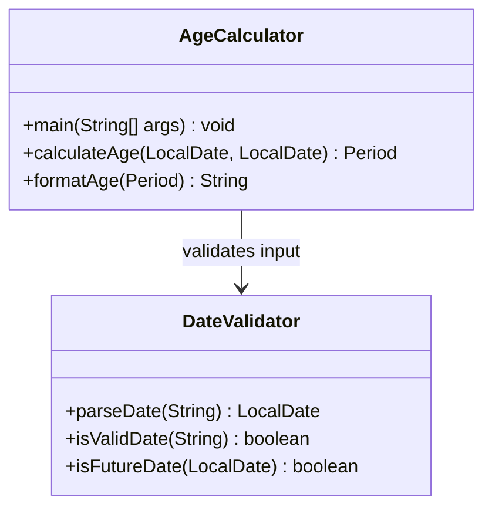

# AgeCalculator API Reference

> **Source:** `src/AgeCalculator.java`

`AgeCalculator` is the **main application class** that serves as the entry point for the Java Age Calculator console application. It reads a Date of Birth from the user via standard input, validates the input by delegating to [`DateValidator`](date-validator.md), calculates the exact age in years, months, and days using `java.time.Period.between()`, and outputs the result in a formatted string. All operations use the modern `java.time` API introduced in Java 8.

### Quick Navigation

- [DateValidator API](date-validator.md) — Input validation methods
- [DateUtils API](date-utils.md) — Optional utility methods for extended age calculations
- [Architecture Overview](../architecture/overview.md) — Class relationships and design decisions
- [Usage Guide](../getting-started/usage.md) — How to run and use the application
- [Test Cases](../testing/test-cases.md) — Test scenarios and expected results
- [README](../../README.md) — Project overview and quick start

---

## Class Overview

`AgeCalculator` is the primary class that orchestrates the entire age calculation workflow. It is responsible for reading user input, delegating validation to `DateValidator`, computing the age via `java.time.Period`, and outputting the formatted result. The class follows Object-Oriented Programming principles with a clear separation of concerns: calculation logic lives in `AgeCalculator`, validation logic lives in `DateValidator`, and optional reusable utilities live in `DateUtils`.

### Capabilities

- **Console-based Date of Birth input** via `java.util.Scanner` — prompts the user with `Enter your Date of Birth (DD/MM/YYYY): ` and reads a single line of text
- **Delegates input validation** to `DateValidator.isValidDate()`, `DateValidator.parseDate()`, and `DateValidator.isFutureDate()` — the `AgeCalculator` class itself does not contain any parsing or validation logic
- **Calculates exact age** in years, months, and days using `Period.between()` from the `java.time` API
- **Formats output** as `Your age is X years, Y months, and Z days.` — the exact format specified for this application
- **Handles exceptions** with meaningful error messages using `try-catch` blocks — every code path that may fail is wrapped in proper exception handling

### Class Signature

```java
import java.time.LocalDate;
import java.time.Period;
import java.util.Scanner;

public class AgeCalculator {
    public static void main(String[] args) { ... }
    public static Period calculateAge(LocalDate birthDate, LocalDate currentDate) { ... }
    public static String formatAge(Period age) { ... }
}
```

### Class Diagram

The following Mermaid class diagram shows the structure of `AgeCalculator` and its relationship with `DateValidator`:



> **Design Note:** Separation of concerns is a core principle of this project. `AgeCalculator` handles orchestration and output, `DateValidator` handles all input parsing and validation, and `DateUtils` (optional) provides reusable utility methods. This design makes each class independently testable and maintainable.

---

## Methods

### main

```java
public static void main(String[] args)
```

**Description:**
The application entry point. Creates a `Scanner` for console input, prompts the user for their Date of Birth in DD/MM/YYYY format, validates the input using `DateValidator`, calculates the age using `calculateAge()`, formats the result using `formatAge()`, and displays the output. All exceptions are caught internally with meaningful error messages displayed to the user.

**Javadoc Tags:**
- `@param args` command-line arguments (unused by this application)

**Parameters:**

| Parameter | Type | Description |
|-----------|------|-------------|
| `args` | `String[]` | Command-line arguments (not used by this application) |

**Returns:**

`void` — Outputs the calculated age result to the console via `System.out.println()`. No value is returned to the caller.

**Throws:**

All exceptions are caught internally and converted to user-friendly error messages. The method does not propagate any exceptions to the JVM.

| Exception | Condition | Handling |
|-----------|-----------|----------|
| `DateTimeParseException` | Invalid date format (e.g., `"hello"`, `"1998-08-15"`) | Caught internally; displays `Error: Invalid date format. Please use DD/MM/YYYY.` |
| `DateTimeParseException` | Invalid calendar date (e.g., `"31/02/2020"`) | Caught internally; displays `Error: Invalid calendar date. The date does not exist on the calendar.` (requires pre-validation to distinguish from format error — see [Exception Handling](#exception-handling)) |
| `DateTimeException` | Broader date-related processing error | Caught internally; displays the exception message |
| `IllegalArgumentException` | Validation constraints violated (e.g., future date) | Caught internally; displays `Error:` followed by the exception message |
| `Exception` | Any unexpected error | Caught internally; displays `An unexpected error occurred. Please try again.` |

> **Note:** Both format errors and invalid calendar dates throw `DateTimeParseException`. A single `catch (DateTimeParseException e)` block cannot distinguish between them. To provide distinct error messages for each case, use `DateValidator.isValidDate()` as a pre-validation step before calling `parseDate()`. See the [Exception Handling](#exception-handling) section and [DateValidator API](date-validator.md) for the recommended pattern.

**Application Flow:**

1. **Prompt:** Display `Enter your Date of Birth (DD/MM/YYYY): ` to the console
2. **Read input:** Capture the user's response via `Scanner.nextLine()`
3. **Pre-validate format:** Call `DateValidator.isValidDate(input)` to check basic DD/MM/YYYY format — if invalid, display a format error and stop
4. **Parse with strict validation:** Call `DateValidator.parseDate(input)` to convert the string to a `LocalDate` with strict calendar validation
5. **Check for future date:** Call `DateValidator.isFutureDate(date)` to reject dates after today
6. **Calculate age:** Call `calculateAge(birthDate, LocalDate.now())` to compute the `Period`
7. **Format output:** Call `formatAge(age)` to build the result string
8. **Display:** Print `Your age is X years, Y months, and Z days.` to the console

**Example 1 — Normal execution:**

```
Enter your Date of Birth (DD/MM/YYYY): 15/08/1998
Your age is 27 years, 6 months, and 15 days.
```

> **Note:** The exact age values depend on the current system date when the application is run.

**Example 2 — Error handling (invalid calendar date):**

```
Enter your Date of Birth (DD/MM/YYYY): 31/02/2020
Error: Invalid calendar date. The date does not exist on the calendar.
```

February does not have 31 days in any year. The `DateValidator.parseDate()` method detects this and throws a `DateTimeParseException`, which is caught in `main()` and presented as a user-friendly error message. Displaying a calendar-specific message (rather than the generic format error) requires pre-validation using `DateValidator.isValidDate()` — see the [Exception Handling](#exception-handling) section for details.

**Example 3 — Error handling (future date):**

```
Enter your Date of Birth (DD/MM/YYYY): 25/12/2030
Error: Date of Birth cannot be in the future.
```

The date December 25, 2030 is after the current system date. `DateValidator.isFutureDate()` returns `true`, and the application displays an error instead of calculating the age.

**Example 4 — Error handling (wrong format):**

```
Enter your Date of Birth (DD/MM/YYYY): hello
Error: Invalid date format. Please use DD/MM/YYYY.
```

The string `hello` cannot be parsed by `java.time.format.DateTimeFormatter` with the `dd/MM/uuuu` pattern (used with `ResolverStyle.STRICT` in `DateValidator`). The resulting `DateTimeParseException` is caught and a clear format instruction is displayed.

---

### calculateAge

```java
public static Period calculateAge(LocalDate birthDate, LocalDate currentDate)
```

**Description:**
Calculates the exact age as a `java.time.Period` object representing the chronological difference in years, months, and days between the birth date and the specified current date. Internally, this method calls `Period.between(birthDate, currentDate)` from the `java.time` API. The resulting `Period` can be queried with `getYears()`, `getMonths()`, and `getDays()` to extract individual components.

**Javadoc Tags:**
- `@param birthDate` the date of birth as a `LocalDate`
- `@param currentDate` the reference date for age calculation (usually today via `LocalDate.now()`)
- `@return` a `Period` object representing the age in years, months, and days
- `@throws IllegalArgumentException` if either parameter is null or if `birthDate` is after `currentDate`

**Parameters:**

| Parameter | Type | Description |
|-----------|------|-------------|
| `birthDate` | `LocalDate` | The date of birth to calculate age from |
| `currentDate` | `LocalDate` | The current date used as the reference point (typically `LocalDate.now()`) |

**Returns:**

`Period` — A `java.time.Period` object representing the age. Use `getYears()`, `getMonths()`, and `getDays()` to access individual components.

**Throws:**

| Exception | Condition |
|-----------|-----------|
| `IllegalArgumentException` | If `birthDate` is `null` |
| `IllegalArgumentException` | If `currentDate` is `null` |
| `IllegalArgumentException` | If `birthDate` is after `currentDate` |

**Example 1 — Normal usage:**

```java
try {
    LocalDate birthDate = LocalDate.of(1998, 8, 15);
    LocalDate currentDate = LocalDate.now();
    Period age = AgeCalculator.calculateAge(birthDate, currentDate);
    System.out.println("Years: " + age.getYears());
    System.out.println("Months: " + age.getMonths());
    System.out.println("Days: " + age.getDays());
} catch (IllegalArgumentException e) {
    System.out.println("Error: " + e.getMessage());
}
```

**Example 2 — Leap year edge case:**

```java
try {
    LocalDate birthDate = LocalDate.of(2000, 2, 29); // Leap year birthday
    LocalDate currentDate = LocalDate.of(2025, 2, 28);
    Period age = AgeCalculator.calculateAge(birthDate, currentDate);
    System.out.println("Years: " + age.getYears());   // 24
    System.out.println("Months: " + age.getMonths()); // 11
    System.out.println("Days: " + age.getDays());     // 30
} catch (IllegalArgumentException e) {
    System.out.println("Error: " + e.getMessage());
}
```

> **Leap Year Note:** When the birth date is February 29 and the current date falls in a non-leap year, `Period.between()` correctly handles the boundary. The `java.time` API accounts for varying month lengths and leap years automatically, so no special-case logic is needed.

**Example 3 — Same-day birthday (edge case):**

```java
try {
    LocalDate birthDate = LocalDate.now();
    LocalDate currentDate = LocalDate.now();
    Period age = AgeCalculator.calculateAge(birthDate, currentDate);
    System.out.println("Years: " + age.getYears());   // 0
    System.out.println("Months: " + age.getMonths()); // 0
    System.out.println("Days: " + age.getDays());     // 0
} catch (IllegalArgumentException e) {
    System.out.println("Error: " + e.getMessage());
}
```

When the birth date and current date are the same, the `Period` is zero across all components. This represents a newborn (or a same-day calculation check) and is a valid edge case.

**Technical Notes:**
- `Period.between()` calculates the chronological period between two dates using the ISO-8601 calendar system
- The result automatically accounts for varying month lengths (28, 29, 30, or 31 days) and leap years
- Passing `currentDate` as a parameter instead of calling `LocalDate.now()` internally makes the method **deterministic and testable** — unit tests can supply a fixed date to produce reproducible results

---

### formatAge

```java
public static String formatAge(Period age)
```

**Description:**
Formats a `java.time.Period` object into a human-readable age string. The output follows the **exact format** specified for this application: `Your age is X years, Y months, and Z days.` This method uses `String.format()` with the `Period` accessors `getYears()`, `getMonths()`, and `getDays()` to construct the result.

**Javadoc Tags:**
- `@param age` the `Period` object representing the calculated age
- `@return` a formatted string in the pattern `Your age is X years, Y months, and Z days.`
- `@throws IllegalArgumentException` if `age` is `null`

**Parameters:**

| Parameter | Type | Description |
|-----------|------|-------------|
| `age` | `Period` | The age as a `Period` object, typically obtained from `calculateAge()` |

**Returns:**

`String` — A formatted string following the exact pattern: `Your age is X years, Y months, and Z days.`

**Throws:**

| Exception | Condition |
|-----------|-----------|
| `IllegalArgumentException` | If `age` is `null` |

> **CRITICAL:** The output format must be **exactly** `Your age is X years, Y months, and Z days.` — including the period at the end. This format is the application's specified output contract.

**Example 1 — Normal usage:**

```java
try {
    Period age = Period.of(27, 6, 15);
    String result = AgeCalculator.formatAge(age);
    System.out.println(result);
    // Output: "Your age is 27 years, 6 months, and 15 days."
} catch (IllegalArgumentException e) {
    System.out.println("Error: " + e.getMessage());
}
```

**Example 2 — Zero values (edge case, newborn):**

```java
try {
    Period age = Period.of(0, 0, 0);
    String result = AgeCalculator.formatAge(age);
    System.out.println(result);
    // Output: "Your age is 0 years, 0 months, and 0 days."
} catch (IllegalArgumentException e) {
    System.out.println("Error: " + e.getMessage());
}
```

When all components of the `Period` are zero, the method still produces a valid formatted string. This represents the edge case of calculating the age on the same day as the Date of Birth.

**Example 3 — Complete workflow (end-to-end):**

```java
try {
    LocalDate birthDate = LocalDate.of(1998, 8, 15);
    LocalDate currentDate = LocalDate.now();
    Period age = AgeCalculator.calculateAge(birthDate, currentDate);
    String result = AgeCalculator.formatAge(age);
    System.out.println(result);
    // Output: "Your age is 27 years, 6 months, and 15 days." (varies by current date)
} catch (IllegalArgumentException e) {
    System.out.println("Error: " + e.getMessage());
}
```

This example demonstrates the typical calling pattern: `calculateAge()` produces a `Period`, and `formatAge()` converts it into the human-readable output string.

---

## Exception Handling

The `AgeCalculator` class uses a structured exception handling strategy where **all exceptions are caught in the `main()` method** using `try-catch` blocks. Individual methods (`calculateAge`, `formatAge`) may throw exceptions, but these are always caught at the top level to ensure the user sees a friendly error message rather than a raw stack trace.

### Exception Hierarchy

| Exception Type | Source | User-Facing Message |
|----------------|--------|---------------------|
| `DateTimeParseException` | `DateValidator.parseDate()` — invalid format | `Error: Invalid date format. Please use DD/MM/YYYY.` |
| `DateTimeParseException` | `DateValidator.parseDate()` — invalid calendar date | `Error: Invalid calendar date. The date does not exist on the calendar.` (requires pre-validation) |
| `DateTimeException` | Broader date processing errors from the `java.time` API | `Error:` followed by the exception message |
| `IllegalArgumentException` | `calculateAge()` or `formatAge()` — null parameters or future birth date | `Error:` followed by the exception message |
| `Exception` | Catch-all for any unexpected errors | `An unexpected error occurred. Please try again.` |

### Exception Handling Pattern

The following code block shows the `try-catch` structure used in the `main()` method:

```java
try {
    // Step 1: Pre-validate format (basic DD/MM/YYYY pattern check)
    if (!DateValidator.isValidDate(input)) {
        System.out.println("Error: Invalid date format. Please use DD/MM/YYYY.");
        return;
    }
    // Step 2: Parse with strict resolver (catches invalid calendar dates like Feb 31)
    LocalDate birthDate = DateValidator.parseDate(input);
    // Step 3: Check for future dates (boolean check, no exception thrown)
    if (DateValidator.isFutureDate(birthDate)) {
        System.out.println("Error: Date of Birth cannot be in the future.");
        return;
    }

    Period age = calculateAge(birthDate, LocalDate.now());
    System.out.println(formatAge(age));
} catch (DateTimeParseException e) {
    // If isValidDate passed but parseDate threw, the date has a valid format
    // but does not exist on the calendar (e.g., 31/02/2020).
    System.out.println("Error: Invalid calendar date. The date does not exist on the calendar.");
} catch (IllegalArgumentException e) {
    System.out.println("Error: " + e.getMessage());
} catch (Exception e) {
    // Catch-all: uses a generic message to avoid exposing raw exception details.
    System.out.println("An unexpected error occurred. Please try again.");
}
```

> **Design Note:** The application follows OOP principles with a clear separation of exception handling responsibilities. The two-step validation approach — `isValidDate()` pre-check followed by `parseDate()` strict parsing — allows the application to distinguish between format errors and invalid calendar dates, displaying specific error messages for each case. Validation exceptions originate in `DateValidator`, calculation exceptions originate in `AgeCalculator`, and all are caught and handled uniformly in `main()`. This pattern keeps the individual methods clean and focused on their core logic while ensuring the user always receives a meaningful response.

---

## Method Summary

| Method | Return Type | Description |
|--------|-------------|-------------|
| `main(String[])` | `void` | Application entry point; reads Date of Birth, validates via `DateValidator`, calculates age, and displays the formatted result |
| `calculateAge(LocalDate, LocalDate)` | `Period` | Calculates age as a `Period` between the birth date and the current date using `Period.between()` |
| `formatAge(Period)` | `String` | Formats a `Period` into the string `Your age is X years, Y months, and Z days.` |

---

## Complete Usage Example

The following complete implementation demonstrates how all three methods work together with `Scanner` input, validation via `DateValidator`, age calculation, and formatted output:

```java
import java.time.LocalDate;
import java.time.Period;
import java.time.format.DateTimeParseException;
import java.util.Scanner;

public class AgeCalculator {
    public static void main(String[] args) {
        Scanner scanner = new Scanner(System.in);
        System.out.print("Enter your Date of Birth (DD/MM/YYYY): ");
        String input = scanner.nextLine();

        try {
            // Step 1: Pre-validate format (basic DD/MM/YYYY pattern check)
            if (!DateValidator.isValidDate(input)) {
                System.out.println("Error: Invalid date format. Please use DD/MM/YYYY.");
                return;
            }
            // Step 2: Parse with strict resolver (catches invalid calendar dates like Feb 31)
            LocalDate birthDate = DateValidator.parseDate(input);
            // Step 3: Check for future dates (boolean check, no exception thrown)
            if (DateValidator.isFutureDate(birthDate)) {
                System.out.println("Error: Date of Birth cannot be in the future.");
                return;
            }

            Period age = calculateAge(birthDate, LocalDate.now());
            System.out.println(formatAge(age));
        } catch (DateTimeParseException e) {
            // If isValidDate passed but parseDate threw, the date has a valid format
            // but does not exist on the calendar (e.g., 31/02/2020).
            System.out.println("Error: Invalid calendar date. The date does not exist on the calendar.");
        } catch (IllegalArgumentException e) {
            System.out.println("Error: " + e.getMessage());
        } catch (Exception e) {
            // Catch-all: uses a generic message to avoid exposing raw exception details.
            System.out.println("An unexpected error occurred. Please try again.");
        } finally {
            scanner.close();
        }
    }

    public static Period calculateAge(LocalDate birthDate, LocalDate currentDate) {
        if (birthDate == null || currentDate == null) {
            throw new IllegalArgumentException("Birth date and current date must not be null.");
        }
        if (birthDate.isAfter(currentDate)) {
            throw new IllegalArgumentException("Birth date cannot be after the current date.");
        }
        return Period.between(birthDate, currentDate);
    }

    public static String formatAge(Period age) {
        if (age == null) {
            throw new IllegalArgumentException("Age period must not be null.");
        }
        return String.format("Your age is %d years, %d months, and %d days.",
            age.getYears(), age.getMonths(), age.getDays());
    }
}
```

### Sample Output

```
Enter your Date of Birth (DD/MM/YYYY): 15/08/1998
Your age is 27 years, 6 months, and 15 days.
```

> **Note:** The exact age values depend on the current system date at the time of execution. The output format is always `Your age is X years, Y months, and Z days.`

### Compilation and Execution

```bash
javac src/AgeCalculator.java src/DateValidator.java
java -cp src AgeCalculator
```

---

## Test Case Scenarios

The following table documents how `AgeCalculator` handles each of the five core test scenarios specified for this project:

| # | Scenario | Input | Expected Behavior |
|---|----------|-------|-------------------|
| 1 | ✅ Normal DOB | `15/08/1998` | Displays `Your age is 27 years, 6 months, and 15 days.` (age varies by current date) |
| 2 | ✅ Leap year DOB | `29/02/2000` | Correctly parses the leap year date and calculates the age; `Period.between()` handles leap year boundaries automatically |
| 3 | ❌ Invalid date | `31/02/2020` | Displays `Error: Invalid calendar date. The date does not exist on the calendar.` — February never has 31 days |
| 4 | ❌ Future date | `25/12/2030` | Displays `Error: Date of Birth cannot be in the future.` — the date has not yet occurred |
| 5 | ❌ Wrong format | `hello` | Displays `Error: Invalid date format. Please use DD/MM/YYYY.` — the input cannot be parsed |

For detailed test scenarios, edge cases, and a comprehensive test matrix, see [Test Cases](../testing/test-cases.md).

---

## See Also

- [DateValidator API Reference](date-validator.md) — Input validation methods used by `AgeCalculator` including `parseDate()`, `isValidDate()`, and `isFutureDate()`
- [DateUtils API Reference](date-utils.md) — Optional utility methods for extended age calculations such as total months, total days, and birthday countdown
- [Architecture Overview](../architecture/overview.md) — Class diagram, data flow, and design decisions explaining how `AgeCalculator`, `DateValidator`, and `DateUtils` relate to each other
- [Usage Guide](../getting-started/usage.md) — User-facing usage instructions, input format details, and error message reference
- [Test Cases](../testing/test-cases.md) — Complete test matrix and all scenarios with expected results
- [Installation Guide](../getting-started/installation.md) — JDK setup, compilation commands, and environment configuration
- [README](../../README.md) — Project overview and quick start guide
