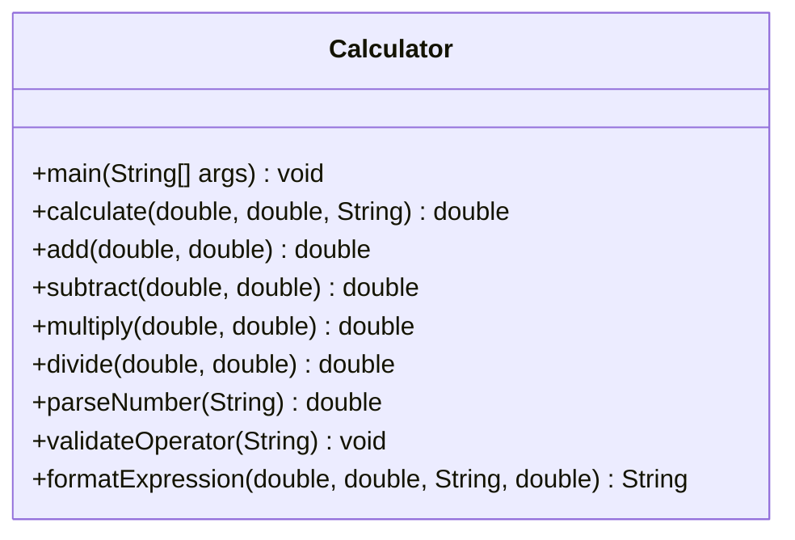

# Calculator API Reference

> **Source:** `src/Calculator.java`

`Calculator` is a **standard arithmetic calculator** console application that provides an interactive command-line interface for performing basic arithmetic operations: addition, subtraction, multiplication, and division. The user enters two numbers and selects an operation, and the calculator displays the result.

### Quick Navigation

- [AgeCalculator API](age-calculator.md) — Age calculation main class
- [DateValidator API](date-validator.md) — Input validation methods
- [DateUtils API](date-utils.md) — Optional utility methods for extended age calculations
- [Architecture Overview](../architecture/overview.md) — Class relationships and design decisions
- [Usage Guide](../getting-started/usage.md) — How to run and use the applications
- [Test Cases](../testing/test-cases.md) — Test scenarios and expected results
- [README](../../README.md) — Project overview and quick start

---

## Class Overview

`Calculator` is a standalone arithmetic calculator that reads numeric input and an operator from the user, performs the calculation, and displays the result. It supports continuous mode — users can perform multiple calculations in a single session.

### Capabilities

- **Four Arithmetic Operations** — Addition (`+`), subtraction (`-`), multiplication (`*`), and division (`/`)
- **Input Validation** — Rejects non-numeric input and invalid operator selections with meaningful error messages
- **Division by Zero Protection** — Detects and rejects division by zero with a clear error message
- **Decimal Support** — Handles both integer and floating-point numbers using `double` precision
- **Continuous Mode** — Allows the user to perform multiple calculations in a single session
- **Clean Number Formatting** — Displays whole numbers without unnecessary decimal places (e.g., `15` instead of `15.0`)
- **Exception Handling** — Proper `try-catch` blocks with meaningful error messages for all failure scenarios

### Class Signature

```java
import java.util.Scanner;

public class Calculator {
    public static void main(String[] args) { ... }
    public static double calculate(double num1, double num2, String operator) { ... }
    public static double add(double a, double b) { ... }
    public static double subtract(double a, double b) { ... }
    public static double multiply(double a, double b) { ... }
    public static double divide(double a, double b) { ... }
    public static double parseNumber(String input) { ... }
    public static void validateOperator(String operator) { ... }
    public static String formatExpression(double num1, double num2, String operator, double result) { ... }
}
```

### Class Diagram



---

## Methods

### main

```java
public static void main(String[] args)
```

**Description:**

Application entry point. Presents an interactive calculator menu that reads two numbers and an operator from the user, performs the calculation, and displays the result. The user can perform multiple calculations in a single session by answering "yes" when prompted to continue.

**Parameters:**

| Parameter | Type | Description |
|-----------|------|-------------|
| `args` | `String[]` | Command-line arguments (not used by this application) |

**Returns:** `void`

**Sample Interaction:**

```
=== Normal Calculator ===
Enter first number: 10
Enter second number: 5
Select operation (+, -, *, /): +
Result: 10 + 5 = 15

Do you want to perform another calculation? (yes/no): no
Thank you for using the Calculator. Goodbye!
```

---

### calculate

```java
public static double calculate(double num1, double num2, String operator)
```

**Description:**

Performs the specified arithmetic operation on two numbers. Supports addition (`+`), subtraction (`-`), multiplication (`*`), and division (`/`).

**Parameters:**

| Parameter | Type | Description |
|-----------|------|-------------|
| `num1` | `double` | The first operand |
| `num2` | `double` | The second operand |
| `operator` | `String` | The arithmetic operator: `"+"`, `"-"`, `"*"`, or `"/"` |

**Returns:** `double` — The result of the arithmetic operation.

**Throws:**

| Exception | Condition |
|-----------|-----------|
| `ArithmeticException` | If `operator` is `"/"` and `num2` is zero |
| `IllegalArgumentException` | If `operator` is not one of `+`, `-`, `*`, `/` |

**Example 1 — Addition:**

```java
double result = Calculator.calculate(10.0, 5.0, "+");
// result: 15.0
```

**Example 2 — Division by zero:**

```java
try {
    double result = Calculator.calculate(10.0, 0.0, "/");
} catch (ArithmeticException e) {
    System.out.println("Error: " + e.getMessage());
    // Output: "Error: Division by zero is not allowed."
}
```

---

### add

```java
public static double add(double a, double b)
```

**Description:** Adds two numbers and returns the sum.

**Parameters:**

| Parameter | Type | Description |
|-----------|------|-------------|
| `a` | `double` | The first addend |
| `b` | `double` | The second addend |

**Returns:** `double` — The sum of `a` and `b`.

**Example:**

```java
double result = Calculator.add(10.0, 5.0); // 15.0
```

---

### subtract

```java
public static double subtract(double a, double b)
```

**Description:** Subtracts the second number from the first and returns the difference.

**Parameters:**

| Parameter | Type | Description |
|-----------|------|-------------|
| `a` | `double` | The minuend |
| `b` | `double` | The subtrahend |

**Returns:** `double` — The difference `a - b`.

**Example:**

```java
double result = Calculator.subtract(10.0, 5.0); // 5.0
```

---

### multiply

```java
public static double multiply(double a, double b)
```

**Description:** Multiplies two numbers and returns the product.

**Parameters:**

| Parameter | Type | Description |
|-----------|------|-------------|
| `a` | `double` | The first factor |
| `b` | `double` | The second factor |

**Returns:** `double` — The product of `a` and `b`.

**Example:**

```java
double result = Calculator.multiply(6.0, 7.0); // 42.0
```

---

### divide

```java
public static double divide(double a, double b)
```

**Description:** Divides the first number by the second and returns the quotient. Throws an `ArithmeticException` if the divisor is zero.

**Parameters:**

| Parameter | Type | Description |
|-----------|------|-------------|
| `a` | `double` | The dividend |
| `b` | `double` | The divisor |

**Returns:** `double` — The quotient `a / b`.

**Throws:**

| Exception | Condition |
|-----------|-----------|
| `ArithmeticException` | If `b` is zero |

**Example:**

```java
double result = Calculator.divide(15.0, 4.0); // 3.75
```

---

### parseNumber

```java
public static double parseNumber(String input)
```

**Description:** Parses a string input into a `double` value. Used to convert user-supplied strings to numeric values.

**Parameters:**

| Parameter | Type | Description |
|-----------|------|-------------|
| `input` | `String` | The string to parse as a number |

**Returns:** `double` — The parsed numeric value.

**Throws:**

| Exception | Condition |
|-----------|-----------|
| `NumberFormatException` | If the input is not a valid number |
| `IllegalArgumentException` | If the input is `null` or empty |

**Example:**

```java
double value = Calculator.parseNumber("42.5"); // 42.5
```

---

### validateOperator

```java
public static void validateOperator(String operator)
```

**Description:** Validates that the given operator is one of the supported arithmetic operators (`+`, `-`, `*`, `/`).

**Parameters:**

| Parameter | Type | Description |
|-----------|------|-------------|
| `operator` | `String` | The operator string to validate |

**Throws:**

| Exception | Condition |
|-----------|-----------|
| `IllegalArgumentException` | If the operator is not supported, `null`, or empty |

**Example:**

```java
Calculator.validateOperator("+"); // No exception
Calculator.validateOperator("%"); // Throws IllegalArgumentException
```

---

### formatExpression

```java
public static String formatExpression(double num1, double num2, String operator, double result)
```

**Description:** Formats the calculation expression and result into a human-readable string with clean number formatting (integers displayed without decimals).

**Parameters:**

| Parameter | Type | Description |
|-----------|------|-------------|
| `num1` | `double` | The first operand |
| `num2` | `double` | The second operand |
| `operator` | `String` | The arithmetic operator used |
| `result` | `double` | The computed result |

**Returns:** `String` — A formatted string like `"10 + 5 = 15"`.

**Example:**

```java
String expr = Calculator.formatExpression(10.0, 5.0, "+", 15.0);
// expr: "10 + 5 = 15"
```

---

## Error Message Catalog

| Error Type | Trigger Condition | Example Input | Error Message |
|-----------|-------------------|---------------|---------------|
| Invalid Number | Non-numeric input for a number field | `abc` | `Invalid number input. Please enter a valid numeric value.` |
| Invalid Operator | Unsupported operator character | `%` | `Invalid operator: '%'. Please use +, -, *, or /.` |
| Division by Zero | Dividing by zero | `10 / 0` | `Division by zero is not allowed.` |
| Empty Input | `null` or empty string for number or operator | *(empty)* | `Input cannot be null or empty.` |

---

## Test Case Scenarios

| # | Scenario | Input | Expected Result |
|---|----------|-------|-----------------|
| 1 | ✅ Addition | `10`, `5`, `+` | `10 + 5 = 15` |
| 2 | ✅ Subtraction | `20`, `4`, `-` | `20 - 4 = 16` |
| 3 | ✅ Multiplication | `6`, `7`, `*` | `6 * 7 = 42` |
| 4 | ✅ Division | `15`, `4`, `/` | `15 / 4 = 3.75` |
| 5 | ❌ Division by zero | `10`, `0`, `/` | `Error: Division by zero is not allowed.` |
| 6 | ❌ Invalid number | `abc`, `5`, `+` | `Error: Invalid number input. Please enter a valid numeric value.` |
| 7 | ❌ Invalid operator | `10`, `5`, `%` | `Error: Invalid operator: '%'. Please use +, -, *, or /.` |
| 8 | ✅ Decimal numbers | `3.5`, `2.1`, `+` | `3.5 + 2.1 = 5.6` |
| 9 | ✅ Negative numbers | `-5`, `3`, `+` | `-5 + 3 = -2` |

### Compilation and Execution

```bash
javac src/Calculator.java
java -cp src Calculator
```

---

## See Also

- [AgeCalculator API Reference](age-calculator.md) — Age calculation main class
- [DateValidator API Reference](date-validator.md) — Input validation methods
- [Architecture Overview](../architecture/overview.md) — System design and class relationships
- [Usage Guide](../getting-started/usage.md) — How to run the applications
- [Test Cases](../testing/test-cases.md) — Complete test matrix
- [README](../../README.md) — Project overview and quick start
