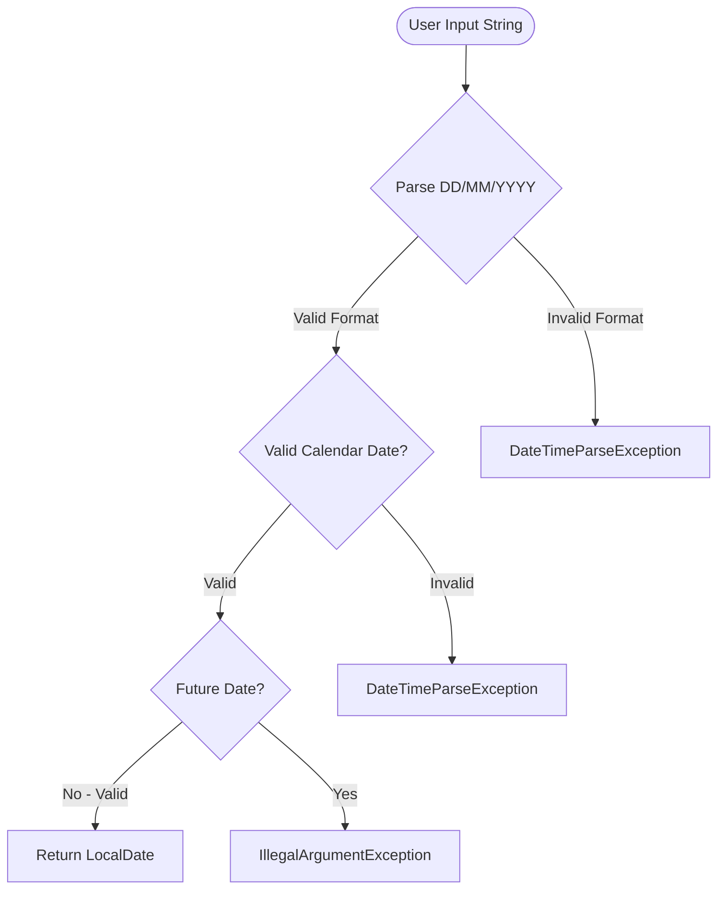
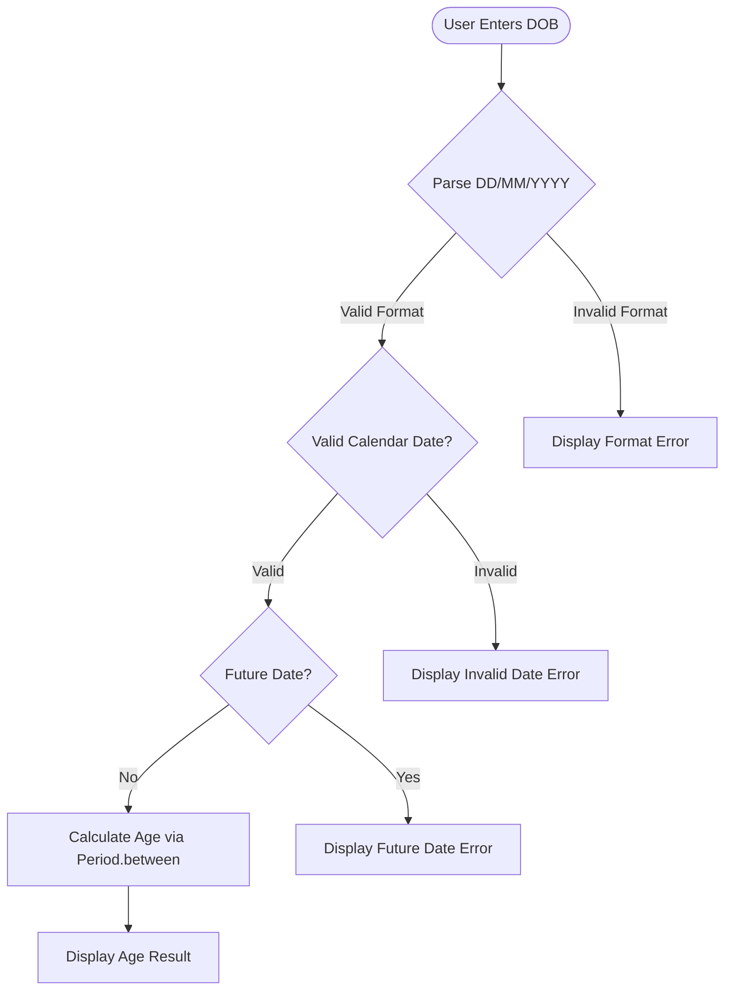

# DateValidator API Reference

> **Source:** `src/DateValidator.java`

`DateValidator` is the **input validation component** of the Java Age Calculator application. It handles all input validation, ensuring that only valid, parseable, past-or-present dates are accepted before age calculation proceeds. Every user-supplied Date of Birth string passes through `DateValidator` before reaching the age calculation logic in [`AgeCalculator`](age-calculator.md).

The class fulfils three core responsibilities:

1. **Parsing user input** from a `DD/MM/YYYY` format string into a `java.time.LocalDate` object
2. **Validating calendar correctness** — rejecting dates that do not exist on the calendar (e.g., `31/02/2020`)
3. **Rejecting future dates** — Date of Birth cannot be after today's date

### Quick Navigation

- [AgeCalculator API](age-calculator.md) — Main application class that uses DateValidator
- [DateUtils API](date-utils.md) — Optional utility methods for extended age calculations
- [Architecture Overview](../architecture/overview.md) — Class relationships and design decisions
- [Usage Guide](../getting-started/usage.md) — Error handling from the user's perspective
- [Test Cases](../testing/test-cases.md) — Validation test scenarios and expected results
- [README](../../README.md) — Project overview and quick start

---

## Class Overview

`DateValidator` provides **static validation methods** used by `AgeCalculator` to ensure user input is a valid date before performing age calculations. No instance of `DateValidator` is needed — all methods are called statically.

### Capabilities

- **Parses DD/MM/YYYY formatted strings** into `LocalDate` objects using `java.time.format.DateTimeFormatter` with the pattern `dd/MM/yyyy`
- **Validates calendar correctness** — rejects non-existent dates such as February 31 or February 29 in non-leap years
- **Detects and rejects future dates** — compares the parsed date against `LocalDate.now()` to ensure the Date of Birth is not after today
- **Provides meaningful error messages** for each failure type, enabling clear user feedback

### Class Signature

```java
import java.time.LocalDate;
import java.time.format.DateTimeFormatter;
import java.time.format.ResolverStyle;

public class DateValidator {
    private static final DateTimeFormatter FORMATTER =
        DateTimeFormatter.ofPattern("dd/MM/yyyy")
            .withResolverStyle(ResolverStyle.STRICT);

    public static LocalDate parseDate(String input) { ... }
    public static boolean isValidDate(String input) { ... }
    public static boolean isFutureDate(LocalDate date) { ... }
}
```

### Relationship with AgeCalculator

`DateValidator` is called by `AgeCalculator.main()` to validate input **before** age calculation proceeds. The `AgeCalculator` class itself contains no parsing or validation logic — it delegates all input handling to `DateValidator`. This separation of concerns makes each class independently testable and maintainable.

### Validation Pipeline Overview

The following diagram shows the complete validation pipeline from user input to either a valid `LocalDate` or an appropriate exception:



> **Design Note:** Each validation step catches a distinct category of invalid input. This layered approach ensures that the user receives a specific, actionable error message rather than a generic failure.

---

## Method Summary

| Method | Return Type | Description |
|--------|-------------|-------------|
| [`parseDate(String)`](#parsedate) | `LocalDate` | Parses a DD/MM/YYYY string to a `LocalDate`; throws on invalid input |
| [`isValidDate(String)`](#isvaliddate) | `boolean` | Returns `true` if the input is a valid DD/MM/YYYY date; never throws |
| [`isFutureDate(LocalDate)`](#isfuturedate) | `boolean` | Returns `true` if the date is after today |

---

## Methods

### parseDate

```java
public static LocalDate parseDate(String input)
```

**Description:**

Parses a date string in `DD/MM/YYYY` format and returns a `java.time.LocalDate` object. Uses `DateTimeFormatter.ofPattern("dd/MM/yyyy")` with `ResolverStyle.STRICT` to ensure calendar validity — for example, February 30 and February 29 in non-leap years are both rejected. This is the primary entry point for converting raw user input into a validated date object.

**Javadoc Tags:**

- `@param input` the date string in DD/MM/YYYY format
- `@return` the parsed `LocalDate` object
- `@throws DateTimeParseException` if the input cannot be parsed or represents an invalid calendar date
- `@throws IllegalArgumentException` if input is `null` or empty

**Parameters:**

| Parameter | Type | Description |
|-----------|------|-------------|
| `input` | `String` | Date string in DD/MM/YYYY format (e.g., `"15/08/1998"`) |

**Returns:**

`LocalDate` — The parsed date as a `java.time.LocalDate` instance representing the user's Date of Birth.

**Throws:**

| Exception | Condition |
|-----------|-----------|
| `DateTimeParseException` | If the input does not match the DD/MM/YYYY format (e.g., `"hello"`, `"1998-08-15"`) |
| `DateTimeParseException` | If the input contains an invalid calendar date (e.g., `"31/02/2020"`, `"29/02/2001"`) |
| `IllegalArgumentException` | If `input` is `null` or an empty string |

**Example 1 — Normal usage (valid date):**

```java
try {
    LocalDate date = DateValidator.parseDate("15/08/1998");
    System.out.println("Parsed date: " + date);
    // Output: "Parsed date: 1998-08-15"
} catch (DateTimeParseException e) {
    System.out.println("Error: Invalid date format. Please use DD/MM/YYYY.");
} catch (IllegalArgumentException e) {
    System.out.println("Error: " + e.getMessage());
}
```

This example demonstrates the standard use case. The string `"15/08/1998"` is parsed into a `LocalDate` representing August 15, 1998.

**Example 2 — Leap year valid date:**

```java
try {
    LocalDate date = DateValidator.parseDate("29/02/2000");
    System.out.println("Parsed date: " + date);
    // Output: "Parsed date: 2000-02-29" (2000 is a leap year)
} catch (DateTimeParseException e) {
    System.out.println("Error: Invalid date format. Please use DD/MM/YYYY.");
}
```

The year 2000 is a leap year (divisible by 400), so February 29 is a valid calendar date. The parser accepts this input and returns the corresponding `LocalDate`.

**Example 3 — Invalid calendar date (edge case):**

```java
try {
    LocalDate date = DateValidator.parseDate("31/02/2020");
    // This line is never reached — February 31 does not exist
} catch (DateTimeParseException e) {
    System.out.println("Error: Invalid date. The date does not exist on the calendar.");
}
```

February never has 31 days in any year. The strict resolver detects this impossible date and throws a `DateTimeParseException`. The catch block displays a meaningful error message to the user.

**Example 4 — Malformed input (edge case):**

```java
try {
    LocalDate date = DateValidator.parseDate("hello");
    // This line is never reached — input is not a date
} catch (DateTimeParseException e) {
    System.out.println("Error: Invalid date format. Please use DD/MM/YYYY.");
}
```

The string `"hello"` does not conform to the `dd/MM/yyyy` pattern at all. The `DateTimeFormatter` immediately throws a `DateTimeParseException`, and the user is instructed to use the correct format.

---

### isValidDate

```java
public static boolean isValidDate(String input)
```

**Description:**

Validates whether a given string represents a valid date in DD/MM/YYYY format. Returns `true` if the string can be successfully parsed into a valid calendar date, `false` otherwise. This method internally attempts to call `parseDate()` and catches any exceptions, converting them to a `false` return value. This method does **NOT** check whether the date is in the future — use [`isFutureDate()`](#isfuturedate) for temporal validation.

**Javadoc Tags:**

- `@param input` the date string to validate
- `@return` `true` if the input is a valid date in DD/MM/YYYY format, `false` otherwise

**Parameters:**

| Parameter | Type | Description |
|-----------|------|-------------|
| `input` | `String` | Date string to validate |

**Returns:**

`boolean` — `true` if the input is a valid DD/MM/YYYY date that exists on the calendar, `false` otherwise.

**Throws:**

Does not throw exceptions — returns `false` for all invalid inputs, including `null` and empty strings.

**Validation Rules:**

| Rule | Valid Example | Invalid Example | Reason |
|------|--------------|-----------------|--------|
| Format must be DD/MM/YYYY | `15/08/1998` | `1998-08-15` | Wrong separator and/or wrong order |
| Day must be 01–31 (month-dependent) | `28/02/2023` | `31/02/2023` | February has at most 28 or 29 days |
| Month must be 01–12 | `15/08/1998` | `15/13/1998` | Month 13 does not exist |
| Year must be 4 digits | `15/08/1998` | `15/08/98` | Two-digit year is ambiguous |
| Leap year correctness | `29/02/2000` | `29/02/2001` | 2001 is not a leap year |

**Example 1 — Normal valid date:**

```java
boolean valid = DateValidator.isValidDate("15/08/1998");
System.out.println("Is valid: " + valid);
// Output: "Is valid: true"
```

The input `"15/08/1998"` matches the DD/MM/YYYY format and represents a real calendar date (August 15, 1998), so the method returns `true`.

**Example 2 — Invalid calendar date:**

```java
boolean valid = DateValidator.isValidDate("31/02/2020");
System.out.println("Is valid: " + valid);
// Output: "Is valid: false" (February 31 does not exist)
```

Although the format looks correct, February 31 is not a valid calendar date in any year. The method returns `false`.

**Example 3 — Wrong format:**

```java
boolean valid = DateValidator.isValidDate("abc/xyz/2000");
System.out.println("Is valid: " + valid);
// Output: "Is valid: false"
```

Non-numeric characters in the day and month positions cannot be parsed by the formatter. The method returns `false` without throwing an exception.

**Example 4 — Leap year edge case:**

```java
boolean valid1 = DateValidator.isValidDate("29/02/2000");
boolean valid2 = DateValidator.isValidDate("29/02/2001");
System.out.println("29/02/2000 valid: " + valid1); // true (leap year)
System.out.println("29/02/2001 valid: " + valid2); // false (not a leap year)
```

The year 2000 is a leap year (divisible by 400), so February 29 is valid. The year 2001 is **not** a leap year, so February 29 does not exist and the method returns `false`. This demonstrates the importance of leap year awareness in date validation.

---

### isFutureDate

```java
public static boolean isFutureDate(LocalDate date)
```

**Description:**

Checks whether the given date is **after** the current date (`LocalDate.now()`). Returns `true` if the date is in the future, `false` if it is today or in the past. This method is used to reject future dates as Date of Birth — a person cannot have been born on a date that has not yet occurred.

**Javadoc Tags:**

- `@param date` the date to check against the current date
- `@return` `true` if the date is in the future, `false` if today or in the past
- `@throws IllegalArgumentException` if `date` is `null`

**Parameters:**

| Parameter | Type | Description |
|-----------|------|-------------|
| `date` | `LocalDate` | The date to check against the current date (`LocalDate.now()`) |

**Returns:**

`boolean` — `true` if the date is after today, `false` otherwise. Today's date is considered **not** future.

**Throws:**

| Exception | Condition |
|-----------|-----------|
| `IllegalArgumentException` | If `date` is `null` |

**Example 1 — Past date (normal usage):**

```java
try {
    LocalDate pastDate = LocalDate.of(1998, 8, 15);
    boolean isFuture = DateValidator.isFutureDate(pastDate);
    System.out.println("Is future: " + isFuture);
    // Output: "Is future: false"
} catch (IllegalArgumentException e) {
    System.out.println("Error: " + e.getMessage());
}
```

August 15, 1998 is in the past, so `isFutureDate()` returns `false`. This is the expected result for any valid Date of Birth.

**Example 2 — Future date (edge case):**

```java
try {
    LocalDate futureDate = LocalDate.of(2030, 12, 25);
    boolean isFuture = DateValidator.isFutureDate(futureDate);
    System.out.println("Is future: " + isFuture);
    // Output: "Is future: true"
    if (isFuture) {
        System.out.println("Error: Date of Birth cannot be in the future.");
    }
} catch (IllegalArgumentException e) {
    System.out.println("Error: " + e.getMessage());
}
```

December 25, 2030 has not yet occurred. The method returns `true`, and the calling code can display an appropriate error message to reject this input as a Date of Birth.

**Example 3 — Today's date (boundary case):**

```java
try {
    LocalDate today = LocalDate.now();
    boolean isFuture = DateValidator.isFutureDate(today);
    System.out.println("Is future: " + isFuture);
    // Output: "Is future: false" (today is not considered future)
} catch (IllegalArgumentException e) {
    System.out.println("Error: " + e.getMessage());
}
```

Today's date is **not** considered to be in the future. A newborn baby born today has a valid Date of Birth equal to today's date, so this boundary case correctly returns `false`.

---

## Error Message Catalog

The following table documents every error message that `DateValidator` methods can trigger. These messages are user-facing and should be displayed exactly as documented.

| Error Type | Trigger Condition | Example Input | Error Message | Resolution |
|-----------|-------------------|---------------|---------------|------------|
| Invalid Format | Input does not match the DD/MM/YYYY pattern | `"hello"`, `"1998-08-15"` | `Invalid date format. Please use DD/MM/YYYY.` | Re-enter using DD/MM/YYYY format with forward slashes |
| Invalid Calendar Date | Date does not exist on the calendar | `"31/02/2020"`, `"29/02/2001"` | `Invalid date. The date does not exist on the calendar.` | Verify the date is real — check leap years and month lengths |
| Future Date | Date is after the current system date | `"25/12/2030"` | `Date of Birth cannot be in the future.` | Enter a past or present date |
| Empty Input | `null` or empty string provided | `""`, `null` | `Input cannot be null or empty.` | Provide a non-empty date string in DD/MM/YYYY format |

> **Note:** The `AgeCalculator.main()` method catches exceptions from `DateValidator` and prepends `"Error: "` before displaying them to the user. For example, `DateTimeParseException` is caught and the console displays `Error: Invalid date format. Please use DD/MM/YYYY.`

---

## Usage with AgeCalculator

The following example shows how `AgeCalculator` uses `DateValidator` in its validation pipeline. This is the typical integration pattern where parsing, validation, and age calculation work together:

```java
// Inside AgeCalculator.main()
Scanner scanner = new Scanner(System.in);
System.out.print("Enter your Date of Birth (DD/MM/YYYY): ");
String input = scanner.nextLine();

try {
    // Step 1: Parse and validate the date
    LocalDate birthDate = DateValidator.parseDate(input);

    // Step 2: Check if date is in the future
    if (DateValidator.isFutureDate(birthDate)) {
        System.out.println("Error: Date of Birth cannot be in the future.");
        return;
    }

    // Step 3: Calculate and display age
    Period age = AgeCalculator.calculateAge(birthDate, LocalDate.now());
    System.out.println(AgeCalculator.formatAge(age));
    // Output: "Your age is X years, Y months, and Z days."
} catch (DateTimeParseException e) {
    System.out.println("Error: Invalid date format. Please use DD/MM/YYYY.");
} catch (Exception e) {
    System.out.println("Error: " + e.getMessage());
}
```

**Step-by-step walkthrough:**

1. **`DateValidator.parseDate(input)`** — Converts the raw string into a `LocalDate`. If the format is wrong or the date is invalid, a `DateTimeParseException` is thrown and caught below.
2. **`DateValidator.isFutureDate(birthDate)`** — Checks whether the parsed date is after today. If it is, an error message is displayed and the method returns early.
3. **`AgeCalculator.calculateAge(birthDate, LocalDate.now())`** — Computes the `Period` between the birth date and today.
4. **`AgeCalculator.formatAge(age)`** — Formats the result as `Your age is X years, Y months, and Z days.`

**Sample interaction (normal case):**

```
Enter your Date of Birth (DD/MM/YYYY): 15/08/1998
Your age is 27 years, 6 months, and 15 days.
```

> **Note:** The exact age values depend on the current system date when the application is run.

---

## Validation Pipeline

The following diagram illustrates the complete validation pipeline from user input to the final age display, including all error paths:



### Pipeline Steps Explained

1. **Parse DD/MM/YYYY** — The `parseDate()` method attempts to convert the input string into a `LocalDate` using `DateTimeFormatter.ofPattern("dd/MM/yyyy")`. If the string does not match the expected pattern (e.g., `"hello"` or `"1998-08-15"`), a **Format Error** is displayed immediately.

2. **Valid Calendar Date?** — The strict resolver (`ResolverStyle.STRICT`) verifies that the parsed date actually exists on the calendar. Dates like `31/02/2020` (February 31) or `29/02/2001` (February 29 in a non-leap year) fail this check, and an **Invalid Date Error** is displayed.

3. **Future Date?** — The `isFutureDate()` method compares the validated date against `LocalDate.now()`. If the date is after today, a **Future Date Error** is displayed because a Date of Birth cannot be in the future.

4. **Calculate Age via Period.between** — If all three validation steps pass, the date is forwarded to `AgeCalculator.calculateAge()` which uses `java.time.Period.between()` to compute the exact age in years, months, and days.

5. **Display Age Result** — The calculated `Period` is formatted and displayed as: `Your age is X years, Y months, and Z days.`

---

## See Also

- [AgeCalculator API Reference](age-calculator.md) — Main application class that uses DateValidator for input validation
- [DateUtils API Reference](date-utils.md) — Optional utility class with extended age calculation methods
- [Architecture Overview](../architecture/overview.md) — Class diagram showing DateValidator's role in the system
- [Usage Guide](../getting-started/usage.md) — User-facing error handling documentation and usage examples
- [Test Cases](../testing/test-cases.md) — Validation test scenarios covering all five test cases
- [README](../../README.md) — Project overview and quick start guide
