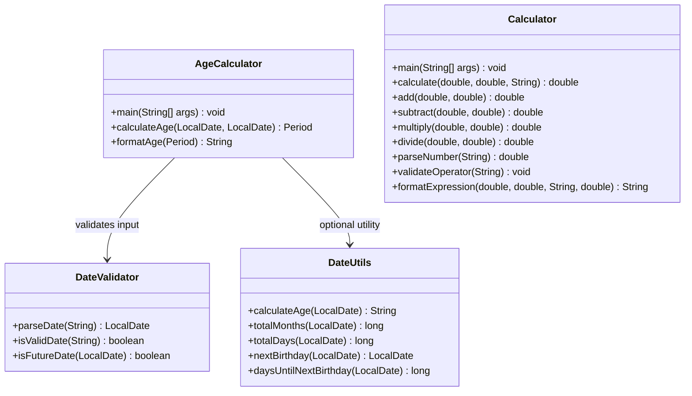
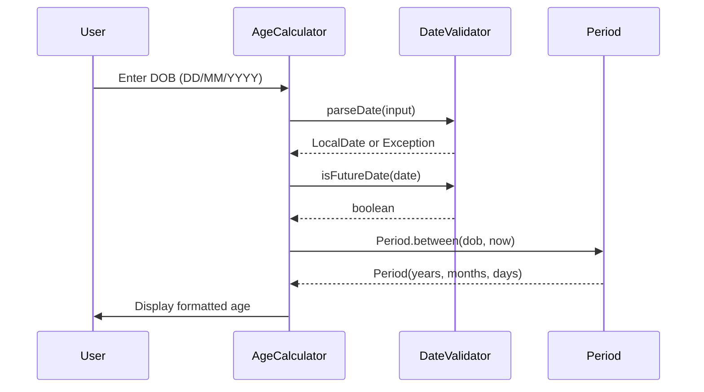
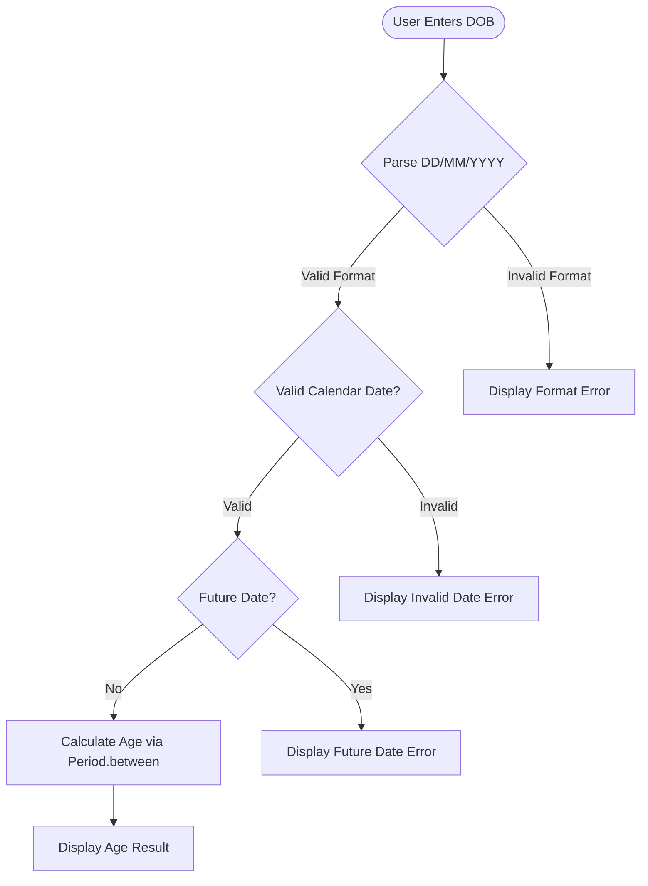

# Architecture Overview

This document provides the **technical architecture reference** for the Java Age Calculator application. It covers the class structure, data flow pipeline, design decisions, and error handling strategy that together form the foundation of the project. The application is a **single-application Java console program** — it is not a microservice, web application, or distributed system. It runs entirely on the local machine, reading input from `System.in` and writing output to `System.out`.

The architecture follows Object-Oriented Programming principles with a clear separation of concerns across three classes: one for application orchestration, one for input validation, and one optional utility class for reusable calculations.

---

## Table of Contents

- [System Overview](#system-overview)
- [Class Diagram](#class-diagram)
- [Data Flow](#data-flow)
- [Sequence Diagram](#sequence-diagram)
- [Validation Flowchart](#validation-flowchart)
- [Design Decisions](#design-decisions)
- [Error Handling Architecture](#error-handling-architecture)
- [See Also](#see-also)

### Quick Navigation

| Document | Description |
|----------|-------------|
| [AgeCalculator API](../api-reference/age-calculator.md) | Detailed method documentation for the main class |
| [DateValidator API](../api-reference/date-validator.md) | Input validation and parsing method documentation |
| [DateUtils API](../api-reference/date-utils.md) | Optional utility class for extended age calculations |
| [Usage Guide](../getting-started/usage.md) | How to run and use the application |
| [Test Cases](../testing/test-cases.md) | Test matrix and expected results |
| [README](../../README.md) | Project overview and quick start |

---

## System Overview

The Age Calculator is a **standalone Java console application** that calculates a user's exact age in years, months, and days from their Date of Birth. The user enters a date in `DD/MM/YYYY` format, and the application responds with a message in the format:

```
Your age is X years, Y months, and Z days.
```

### Technology Stack

| Component | Technology | Details |
|-----------|-----------|---------|
| **Language** | Java 8+ | JDK 8 minimum required for the `java.time` API |
| **Core APIs** | `java.time.LocalDate`, `java.time.Period`, `java.time.format.DateTimeFormatter` | Modern date/time API introduced in Java 8 (JSR-310) |
| **Input** | `java.util.Scanner` | Interactive console input for Date of Birth entry |
| **Build** | Direct `javac` compilation | No Maven or Gradle build tool required |
| **Architecture Pattern** | Single-application, Object-Oriented design | Separation of concerns across dedicated classes |

### Four-Class Architecture

The project is composed of four classes, each with a single, well-defined responsibility:

1. **`AgeCalculator`** — Main age calculator class serving as an entry point. Handles console I/O, orchestrates the validation and calculation workflow, and formats the final output for age calculation.

2. **`DateValidator`** — Input validation class responsible for parsing `DD/MM/YYYY` strings into `LocalDate` objects, checking calendar validity (rejecting dates like February 31), and rejecting future dates. Called by `AgeCalculator` before any calculation begins.

3. **`DateUtils`** *(optional enhancement)* — Reusable utility class providing additional age-related calculations such as total age in months, total age in days, next birthday date, and countdown to next birthday. This class can be used independently in other Java projects.

4. **`Calculator`** — A standalone normal arithmetic calculator class providing an interactive console interface for addition, subtraction, multiplication, and division. Features input validation, division by zero protection, decimal support, and continuous operation mode.

> **Note:** The project has **no external dependencies** — it uses only the Java Standard Library. There is no database, no network communication, and no configuration files. Both applications are pure console I/O programs.

*Source: `src/AgeCalculator.java`, `src/DateValidator.java`, `src/DateUtils.java`, `src/Calculator.java`*

---

## Class Diagram

The following diagram shows the Object-Oriented structure of the application, including all public methods and the relationships between classes.



### Class Responsibilities

**`AgeCalculator`** — The entry point of the age calculator. The `main` method reads user input via `Scanner`, delegates validation to `DateValidator`, computes the age using `calculateAge(LocalDate, LocalDate)` which returns a `java.time.Period`, and formats the result via `formatAge(Period)` into the string `Your age is X years, Y months, and Z days.`. See the [AgeCalculator API Reference](../api-reference/age-calculator.md) for detailed method documentation.

**`DateValidator`** — Responsible for all input validation. The `parseDate(String)` method converts a `DD/MM/YYYY` string into a `LocalDate` using `DateTimeFormatter`. The `isValidDate(String)` method checks whether a string represents a real calendar date. The `isFutureDate(LocalDate)` method rejects dates that occur after today. This class is called by `AgeCalculator.main()` before any calculation takes place. See the [DateValidator API Reference](../api-reference/date-validator.md) for detailed method documentation.

**`DateUtils`** *(optional)* — A reusable utility class providing five convenience methods: `calculateAge(LocalDate)` returns a formatted age string, `totalMonths(LocalDate)` and `totalDays(LocalDate)` return the total age as a single number, `nextBirthday(LocalDate)` computes the next upcoming birthday date, and `daysUntilNextBirthday(LocalDate)` returns the countdown in days. This class can be used independently in other projects without the console I/O layer. See the [DateUtils API Reference](../api-reference/date-utils.md) for detailed method documentation.

**`Calculator`** — A standalone normal arithmetic calculator providing an interactive console interface. Supports four operations: addition (`+`), subtraction (`-`), multiplication (`*`), and division (`/`). Features input validation via `parseNumber()` and `validateOperator()`, division by zero protection, decimal support, continuous operation mode, and clean number formatting. See the [Calculator API Reference](../api-reference/calculator.md) for detailed method documentation.

### Relationships

- **`AgeCalculator` → `DateValidator`** — AgeCalculator depends on DateValidator for input validation. This is a **mandatory** dependency; the application cannot function without validation.
- **`AgeCalculator` → `DateUtils`** — AgeCalculator can optionally use DateUtils for extended calculations such as total months, total days, and birthday countdown. This is an **optional** dependency for enhancement features.
- **`Calculator`** — Calculator is a **standalone** class with no dependencies on the other classes. It handles its own input validation internally.
- **`DateValidator` ↔ `DateUtils`** — These two classes are **independent** of each other. Neither imports nor references the other. They can be tested, modified, and reused in isolation.

---

## Data Flow

The complete data flow pipeline from user input to console output consists of eight steps. If any validation step fails, the flow short-circuits to an error message.

| Step | Stage | Description | Component |
|------|-------|-------------|-----------|
| 1 | **User Input** | User enters Date of Birth as a string in `DD/MM/YYYY` format via the console | `Scanner` in `AgeCalculator.main()` |
| 2 | **Input Parsing** | `DateValidator.parseDate()` converts the string to a `LocalDate` object using `DateTimeFormatter.ofPattern("dd/MM/uuuu")` with `ResolverStyle.STRICT` | `DateValidator` |
| 3 | **Format Validation** | If the string does not match the `DD/MM/YYYY` pattern, a `DateTimeParseException` is thrown | `DateValidator` |
| 4 | **Calendar Validation** | If the date is not a real calendar date (e.g., `31/02/2020`), a `DateTimeParseException` is thrown | `DateValidator` |
| 5 | **Temporal Validation** | `DateValidator.isFutureDate()` checks whether the parsed `LocalDate` is after `LocalDate.now()` | `DateValidator` |
| 6 | **Age Calculation** | `AgeCalculator.calculateAge()` computes `Period.between(birthDate, currentDate)`, returning a `Period` object containing years, months, and days | `AgeCalculator` |
| 7 | **Output Formatting** | `AgeCalculator.formatAge()` converts the `Period` into the output string `Your age is X years, Y months, and Z days.` | `AgeCalculator` |
| 8 | **Display** | The formatted string is printed to the console via `System.out.println()` | `AgeCalculator.main()` |

> **Short-Circuit Behavior:** On any validation failure at steps 3, 4, or 5, the pipeline terminates immediately and a user-friendly error message is displayed instead of the age result.

### Flow Summary

```
User Input (String) → parseDate() → LocalDate → isFutureDate() → calculateAge() → Period → formatAge() → String → Console Output
```

*Source: `src/AgeCalculator.java`, `src/DateValidator.java`*

---

## Sequence Diagram

The following diagram shows the runtime interaction between the user, `AgeCalculator`, `DateValidator`, and `Period` during a **successful** age calculation (the happy path).



### Interaction Steps

1. **User → AgeCalculator:** The user provides their Date of Birth as a `DD/MM/YYYY` string. The `AgeCalculator.main()` method reads this input using `java.util.Scanner`.

2. **AgeCalculator → DateValidator (`parseDate`):** `AgeCalculator` delegates input parsing to `DateValidator.parseDate(input)`. On success, a `LocalDate` object is returned. On failure (invalid format or invalid calendar date), a `DateTimeParseException` is thrown and the sequence terminates with an error message.

3. **AgeCalculator → DateValidator (`isFutureDate`):** `AgeCalculator` calls `DateValidator.isFutureDate(date)` to verify the date is not in the future. The method returns `true` if the date is after today (triggering an error) or `false` if the date is valid.

4. **AgeCalculator → Period (`Period.between`):** On valid input, `AgeCalculator` calls `Period.between(birthDate, LocalDate.now())` to compute the exact age. The `Period` object contains the years, months, and days components.

5. **AgeCalculator → User (Display):** The resulting `Period` is formatted via `formatAge()` into the string `Your age is X years, Y months, and Z days.` and displayed to the user.

> **Error Scenarios:** In error cases, the sequence terminates early. After `parseDate` throws an exception or `isFutureDate` returns `true`, `AgeCalculator` displays an error message directly to the user and the `Period.between` call is never reached.

*Source: `src/AgeCalculator.java`, `src/DateValidator.java`*

---

## Validation Flowchart

The following flowchart illustrates the complete validation pipeline and age calculation decision tree. Every user input passes through three validation gates before the age is calculated and displayed.



### Decision Points

**Parse DD/MM/YYYY** — Uses `DateTimeFormatter.ofPattern("dd/MM/uuuu")` with `ResolverStyle.STRICT`. The proleptic year field `uuuu` is used instead of `yyyy` because `STRICT` mode requires it (see [DateValidator API — Class Signature](../api-reference/date-validator.md#class-signature) for details). If the input string does not match the expected `DD/MM/YYYY` pattern, a `DateTimeParseException` is thrown immediately. Failure example: entering `hello` or `1998-08-15` triggers a format error.

**Valid Calendar Date?** — Checks whether the parsed date actually exists on the calendar. The strict resolver rejects dates such as `31/02/2020` (February has at most 29 days) and `29/02/2023` (2023 is not a leap year). Leap year dates like `29/02/2000` pass this check because 2000 is a valid leap year.

**Future Date?** — Compares the parsed `LocalDate` with `LocalDate.now()`. If the Date of Birth is after today, the application rejects it with an error. For example, entering `25/12/2030` when today is in 2025 triggers the future date error.

**Calculate Age** — `Period.between(birthDate, currentDate)` computes the exact difference in years, months, and days between the Date of Birth and today's date.

**Display Age Result** — The calculated `Period` is formatted and displayed as: `Your age is X years, Y months, and Z days.`

### Test Case Mapping

The five user-specified test scenarios map directly to the flowchart paths:

| Test Case | Input | Flowchart Path | Result |
|-----------|-------|----------------|--------|
| ✅ Normal DOB | `15/08/1998` | Start → Parse (valid) → Calendar (valid) → Future (no) → Calculate → Display | `Your age is X years, Y months, and Z days.` |
| ✅ Leap year DOB | `29/02/2000` | Start → Parse (valid) → Calendar (valid — leap year) → Future (no) → Calculate → Display | `Your age is X years, Y months, and Z days.` |
| ❌ Invalid date | `31/02/2020` | Start → Parse (valid format) → Calendar (**invalid** — Feb 31 does not exist) → Display Invalid Date Error | Error message displayed |
| ❌ Future date | *(date after today)* | Start → Parse (valid) → Calendar (valid) → Future (**yes**) → Display Future Date Error | Error message displayed |
| ❌ Wrong format | *(e.g., `hello`)* | Start → Parse (**invalid format**) → Display Format Error | Error message displayed |

See the [Test Cases](../testing/test-cases.md) document for the complete test matrix with expected outputs.

*Source: `src/DateValidator.java`, `src/AgeCalculator.java`*

---

## Design Decisions

### Why `java.time` API (JSR-310)?

The project exclusively uses `java.time.LocalDate`, `java.time.Period`, and `java.time.format.DateTimeFormatter` — the modern date/time API introduced in Java 8 under JSR-310. This was a deliberate design choice over the legacy alternatives.

**Why the legacy `java.util.Date` and `java.util.Calendar` were avoided:**

| Concern | Legacy API Problem | `java.time` Solution |
|---------|-------------------|---------------------|
| **Mutability** | `java.util.Date` is mutable — its value can change after creation, leading to subtle bugs | `LocalDate` is **immutable** — once created, it cannot be modified |
| **Thread Safety** | `java.util.Date` and `SimpleDateFormat` are not thread-safe | All `java.time` classes are **thread-safe** by design |
| **API Design** | `java.util.Date` months are 0-indexed (January = 0), and years are offset from 1900 | `LocalDate` uses intuitive 1-indexed months and standard years |
| **Verbosity** | `java.util.Calendar` requires verbose code with magic constants (`Calendar.YEAR`, `Calendar.MONTH`) | `Period.between()` directly returns years, months, and days in a single call |
| **Validation** | `SimpleDateFormat` silently accepts invalid dates (e.g., February 31) unless explicitly configured | `DateTimeFormatter` with strict resolver throws `DateTimeParseException` for invalid dates |
| **Age Calculation** | Manual arithmetic required to compute age from two `Date` objects | `Period.between(birthDate, currentDate)` computes the exact difference automatically |

> **Critical:** The legacy `java.util.Date` and `java.util.Calendar` classes are referenced here **only** to explain why they were rejected. They are never used in the application and should never be introduced into the codebase.

### Object-Oriented Design Principles

The application follows established Object-Oriented Design principles to ensure maintainability and testability.

**Single Responsibility Principle (SRP):**

Each class has exactly one reason to change:

- **`AgeCalculator`** — Responsible for application flow, user I/O, and age calculation. Changes only when the application workflow or output format changes.
- **`DateValidator`** — Responsible for all input validation logic. Changes only when validation rules change (e.g., adding new date formats).
- **`DateUtils`** — Responsible for reusable utility calculations. Changes only when new calculation methods are added.

**Separation of Concerns:**

- Input parsing and validation are isolated in `DateValidator`, completely separate from the age calculation logic in `AgeCalculator`.
- Output formatting (`formatAge`) is a dedicated method, not interleaved with calculation logic (`calculateAge`).
- Error handling is centralized in the `main()` method through `try-catch` blocks, keeping individual methods focused on their core logic.

**Static Methods:**

All public methods across all three classes are declared as `public static`. This design choice is intentional:

- No instance state is needed — every method operates solely on its parameters and returns a result.
- This matches the **utility class pattern** common in the Java Standard Library (e.g., `Math`, `Collections`, `Arrays`).
- Calling code does not need to create objects to use the functionality: `AgeCalculator.calculateAge(dob, now)` works directly.

### Separation of Validation and Calculation

Validation is deliberately delegated to `DateValidator` rather than being embedded in `AgeCalculator`. This architectural decision provides three key benefits:

1. **Independent Testing** — Validation logic can be unit tested in isolation without any console I/O. Each validation method (`parseDate`, `isValidDate`, `isFutureDate`) can be tested with known inputs and expected outputs.

2. **Reuse in Other Contexts** — If the application is extended with a GUI (Java Swing or JavaFX), the same `DateValidator` class can validate input from text fields without any modification. See the [Optional Enhancements](../enhancements/optional-features.md) guide for GUI extension details.

3. **Clear Error Handling Boundaries** — `DateValidator` methods signal failures by throwing exceptions or returning boolean values. `AgeCalculator.main()` catches these signals and translates them into user-friendly messages. This keeps the error translation layer separate from the error detection layer.

---

## Error Handling Architecture

The application uses a structured exception handling strategy where validation methods **throw** exceptions and the `main()` method **catches** them. This ensures that every error is translated into a meaningful, human-readable message before being displayed to the user.

### Exception Handling Strategy

- All exceptions are caught in `AgeCalculator.main()` using `try-catch` blocks.
- `DateValidator` methods **throw** exceptions to signal validation failures — they do not print error messages themselves.
- `AgeCalculator.main()` **catches** these exceptions and displays user-friendly error messages via `System.out.println()`.
- Raw exception messages and stack traces are **never** exposed to the user on the primary validation path. For application-controlled exceptions (`IllegalArgumentException`) the message text is authored by the application code itself and is safe to display. The catch-all `Exception` handler uses a fully generic message to guard against unexpected exception types.

### Exception Propagation Chain

The following chain describes how each type of error propagates through the system:

1. **`DateValidator.parseDate()`** → Throws `DateTimeParseException` when the input string has an invalid format or represents a non-existent calendar date → Caught by the `catch (DateTimeParseException e)` block in `main()`.

2. **`DateValidator.isFutureDate()`** → Returns a `boolean` value (`true` if the date is in the future, `false` otherwise) → Checked by an `if` statement in `main()`. No exception is thrown for future dates.

3. **`AgeCalculator.calculateAge()`** → May throw `IllegalArgumentException` if a `null` value is passed as the birth date or current date → Caught by the `catch (IllegalArgumentException e)` block in `main()`.

### Code Example

The following code illustrates the exception handling pattern used in the `main()` method. Note the two-step validation approach: `isValidDate()` performs a preliminary format check, while `parseDate()` performs strict calendar validation. This separation allows the application to display distinct error messages for format errors versus invalid calendar dates:

```java
try {
    // Step 1: Validate format (basic DD/MM/YYYY pattern check)
    if (!DateValidator.isValidDate(input)) {
        System.out.println("Error: Invalid date format. Please use DD/MM/YYYY.");
        return;
    }
    // Step 2: Parse with strict resolver (catches invalid calendar dates like Feb 31)
    LocalDate birthDate = DateValidator.parseDate(input);
    // Step 3: Check for future dates (boolean check, no exception thrown)
    if (DateValidator.isFutureDate(birthDate)) {
        System.out.println("Error: Date of Birth cannot be in the future.");
        return;
    }
    Period age = calculateAge(birthDate, LocalDate.now());
    System.out.println(formatAge(age));
} catch (DateTimeParseException e) {
    // If isValidDate passed but parseDate threw, the date has a valid format
    // but does not exist on the calendar (e.g., 31/02/2020).
    System.out.println("Error: Invalid calendar date. The date does not exist on the calendar.");
} catch (IllegalArgumentException e) {
    // Application-controlled messages (e.g., null input) — safe to display directly.
    System.out.println("Error: " + e.getMessage());
} catch (Exception e) {
    // Catch-all: uses a generic message to avoid exposing raw exception details.
    System.out.println("An unexpected error occurred. Please try again.");
}
```

### Error Message Catalog

The table below lists every error condition, its corresponding exception type, and the user-facing message displayed by the application:

| Error Condition | Exception Type | User-Facing Message |
|----------------|---------------|---------------------|
| Invalid format (e.g., `hello`) | `DateTimeParseException` | `Error: Invalid date format. Please use DD/MM/YYYY.` |
| Invalid calendar date (e.g., `31/02/2020`) | `DateTimeParseException` | `Error: Invalid calendar date. The date does not exist on the calendar.` |
| Future date (e.g., a date after today) | None (boolean check) | `Error: Date of Birth cannot be in the future.` |
| Null or empty input | `IllegalArgumentException` | `Error: Input cannot be null or empty.` |
| Unexpected error | `Exception` (catch-all) | `An unexpected error occurred. Please try again.` |

> **Design Principle:** Never expose raw exception messages or stack traces to the user on the primary validation path. The `DateTimeParseException` catch block uses a fixed, descriptive message. The `IllegalArgumentException` catch block displays `e.getMessage()` because these exceptions are thrown by application code with controlled, user-friendly message text. The catch-all `Exception` handler uses a fully generic message to guard against exposing details from unexpected exception types.

*Source: `src/AgeCalculator.java` — `main()`, `src/DateValidator.java`*

---

## See Also

- [AgeCalculator API Reference](../api-reference/age-calculator.md) — Detailed method documentation for the age calculator class
- [Calculator API Reference](../api-reference/calculator.md) — Detailed method documentation for the normal calculator class
- [DateValidator API Reference](../api-reference/date-validator.md) — Detailed validation method documentation
- [DateUtils API Reference](../api-reference/date-utils.md) — Optional utility class documentation
- [Usage Guide](../getting-started/usage.md) — How to run and use the applications
- [Installation Guide](../getting-started/installation.md) — JDK setup and compilation
- [Test Cases](../testing/test-cases.md) — Test matrix and scenario documentation
- [Optional Enhancements](../enhancements/optional-features.md) — GUI, utility class, birthday countdown
- [README](../../README.md) — Project overview and quick start
