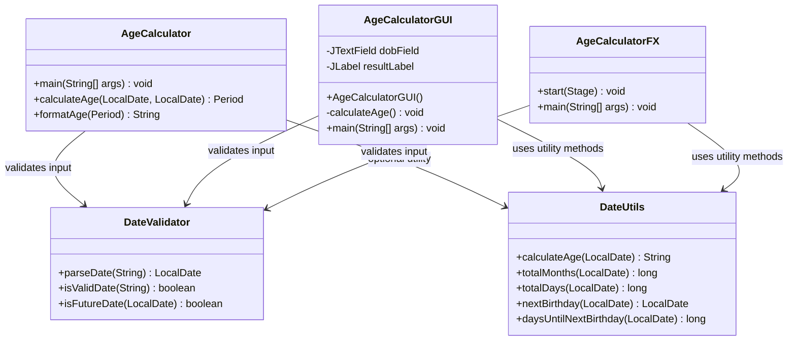

# Optional Enhancements Guide

This document covers **five optional enhancements** for extending the core Age Calculator console application with additional features. Each enhancement builds upon the existing `AgeCalculator` and `DateValidator` classes to add new capabilities — from alternative age representations and birthday countdowns to full graphical user interfaces and a reusable utility class.

These enhancements are designed to be **implemented incrementally** — each one can be added independently without modifying or breaking the existing core functionality. They follow the **Open/Closed Principle**: the application is extended with new classes and methods rather than altering working code.

Whether you are building a portfolio project, preparing for a technical interview, or simply exploring Java's `java.time` API in greater depth, these enhancements demonstrate practical applications of Object-Oriented Programming, event-driven GUI design, and utility class patterns.

---

## Table of Contents

1. [Total Age in Months and Days](#1-total-age-in-months-and-days)
2. [Birthday Countdown Feature](#2-birthday-countdown-feature)
3. [Java Swing GUI](#3-java-swing-gui)
4. [JavaFX GUI Alternative](#4-javafx-gui-alternative)
5. [Reusable Utility Class (DateUtils)](#5-reusable-utility-class-dateutils)
6. [Architecture Guidance](#architecture-guidance)
7. [Summary](#summary)
8. [See Also](#see-also)

### Related Documentation

| Document | Description |
|----------|-------------|
| [AgeCalculator API Reference](../api-reference/age-calculator.md) | Main application class — console I/O, age calculation, and output formatting |
| [DateValidator API Reference](../api-reference/date-validator.md) | Input validation — date parsing, format checking, and future date rejection |
| [DateUtils API Reference](../api-reference/date-utils.md) | Utility class — full API details for all five static utility methods |
| [Architecture Overview](../architecture/overview.md) | Class diagrams, data flow pipeline, and design decisions |
| [Getting Started](../getting-started/installation.md) | JDK setup, compilation, and running the application |
| [README](../../README.md) | Project overview and quick start guide |

---

## 1. Total Age in Months and Days

### Description

Extend the age output to include **alternative representations** — the total number of months and the total number of days the user has lived since birth. While the core application displays age as a breakdown of years, months, and days, this enhancement adds two additional lines showing the **cumulative totals** as single numeric values.

### Approach

Use `java.time.temporal.ChronoUnit.MONTHS` and `java.time.temporal.ChronoUnit.DAYS` to compute the total elapsed months and days between the birth date and the current date. These methods return a single `long` value representing the **entire** duration, not just the remainder after extracting years.

### Implementation

Add a `displayExtendedAge()` method to the existing `AgeCalculator` class. This method supplements the primary age output with total months and total days:

```java
import java.time.LocalDate;
import java.time.temporal.ChronoUnit;

public class AgeCalculator {
    // ... existing methods ...

    public static void displayExtendedAge(LocalDate birthDate) {
        try {
            LocalDate currentDate = LocalDate.now();
            long totalMonths = ChronoUnit.MONTHS.between(birthDate, currentDate);
            long totalDays = ChronoUnit.DAYS.between(birthDate, currentDate);

            System.out.println("Total months lived: " + totalMonths);
            System.out.println("Total days lived: " + totalDays);
        } catch (Exception e) {
            System.out.println("Error calculating extended age: " + e.getMessage());
        }
    }
}
```

### Sample Output

```
Enter your Date of Birth (DD/MM/YYYY): 15/08/1998
Your age is 27 years, 6 months, and 15 days.
Total months lived: 330
Total days lived: 10046
```

> **Note:** The total months and total days values vary depending on the current date when the application is run.

### Leap Year Handling

`ChronoUnit.DAYS.between()` correctly accounts for leap years in the total day count. Leap years contribute 366 days instead of 365, and this is handled automatically by the `java.time` API. For example, a person born on `01/01/2000` has one additional day in their total for each leap year they have lived through (2000, 2004, 2008, and so on). No special-case logic is needed.

### Integration Note

This enhancement is **purely additive** — it extends the existing console output without modifying the core `Period.between()` calculation logic. The primary output format remains exactly:

```
Your age is X years, Y months, and Z days.
```

The extended output lines are appended after the primary result.

### Key API Reference

- `java.time.temporal.ChronoUnit.MONTHS` — Computes the total number of complete months between two dates
- `java.time.temporal.ChronoUnit.DAYS` — Computes the total number of days between two dates

See [DateUtils API Reference](../api-reference/date-utils.md) for the `totalMonths()` and `totalDays()` utility methods that encapsulate this logic in a reusable form.

---

## 2. Birthday Countdown Feature

### Description

Calculate and display the user's **next birthday date** and the **number of days remaining** until it arrives. This enhancement adds a practical, engaging feature that extends the core age calculator with forward-looking date computation.

### Algorithm

The birthday countdown algorithm follows five steps:

1. **Extract month and day** from the birth date
2. **Create a candidate date** for this year using the birth month and day
3. **Handle leap year birthdays** (February 29) — if the current year is not a leap year, adjust the candidate date
4. **Check if this year's birthday has passed** — if so, advance to next year (and re-check leap year handling)
5. **Calculate days remaining** using `ChronoUnit.DAYS.between(today, nextBirthday)`

### Leap Year Birthday Design Decision

When a person is born on **February 29** and the current year is **not a leap year**, there are two common approaches:

| Approach | Behavior | Pros | Cons |
|----------|----------|------|------|
| **(a) Use March 1** | Celebrate on March 1 in non-leap years | Simple, consistent, one celebration per year | Birthday shifts by one day |
| **(b) Wait for next leap year** | Only celebrate on Feb 29 every four years | Preserves exact date | Up to 3-year gap between celebrations |

**Recommended approach: (a) Use March 1** — This is the standard convention used by most calendar applications and ensures the user receives a countdown result every year. The implementation below uses this approach.

### Implementation

```java
import java.time.LocalDate;
import java.time.temporal.ChronoUnit;

public class BirthdayCountdown {
    public static LocalDate nextBirthday(LocalDate birthDate) {
        try {
            LocalDate today = LocalDate.now();
            LocalDate birthdayThisYear = birthDate.withYear(today.getYear());

            // Handle leap year birthday (Feb 29) in non-leap years
            if (birthDate.getMonthValue() == 2 && birthDate.getDayOfMonth() == 29) {
                if (!birthdayThisYear.isLeapYear()) {
                    birthdayThisYear = LocalDate.of(today.getYear(), 3, 1);
                }
            }

            if (birthdayThisYear.isBefore(today) || birthdayThisYear.isEqual(today)) {
                birthdayThisYear = birthdayThisYear.plusYears(1);
                // Re-check leap year for next year
                if (birthDate.getMonthValue() == 2 && birthDate.getDayOfMonth() == 29) {
                    if (!birthdayThisYear.isLeapYear()) {
                        birthdayThisYear = LocalDate.of(birthdayThisYear.getYear(), 3, 1);
                    }
                }
            }

            return birthdayThisYear;
        } catch (Exception e) {
            throw new IllegalArgumentException("Error calculating next birthday: " + e.getMessage());
        }
    }

    public static long daysUntilNextBirthday(LocalDate birthDate) {
        try {
            LocalDate next = nextBirthday(birthDate);
            return ChronoUnit.DAYS.between(LocalDate.now(), next);
        } catch (Exception e) {
            throw new IllegalArgumentException("Error: " + e.getMessage());
        }
    }
}
```

### Sample Output

```
Enter your Date of Birth (DD/MM/YYYY): 15/08/1998
Your age is 27 years, 6 months, and 15 days.
Next birthday: 15/08/2026
Days until next birthday: 138
```

> **Note:** Values vary depending on the current date when the application is run.

### Leap Year Birthday Edge Case

The following example demonstrates how February 29 birthdays are handled in non-leap years:

```java
try {
    LocalDate leapBirthday = LocalDate.of(2000, 2, 29);
    LocalDate next = BirthdayCountdown.nextBirthday(leapBirthday);
    long days = BirthdayCountdown.daysUntilNextBirthday(leapBirthday);
    System.out.println("Next birthday: " + next);
    System.out.println("Days remaining: " + days);
} catch (IllegalArgumentException e) {
    System.out.println("Error: " + e.getMessage());
}
```

In a non-leap year (e.g., 2025), the output would show the next birthday as **March 1** of that year (or of the following year if March 1 has already passed). In a leap year (e.g., 2028), the output would correctly show **February 29**.

See [DateUtils API Reference](../api-reference/date-utils.md) for the `nextBirthday()` and `daysUntilNextBirthday()` utility methods that provide this functionality in a reusable form.

---

## 3. Java Swing GUI

### Description

Create a **graphical user interface** using Java Swing (`javax.swing`) to replace the console-based interaction. The Swing GUI provides a window with a text field for Date of Birth entry, a button to trigger the calculation, and a label to display the result — making the application more accessible and visually interactive.

### GUI Components

The Swing-based Age Calculator uses the following components:

| Component | Swing Class | Purpose |
|-----------|-------------|---------|
| Main Window | `JFrame` | Top-level application window with title bar and close button |
| Prompt Label | `JLabel` | Displays `Enter Date of Birth (DD/MM/YYYY):` above the input field |
| Input Field | `JTextField` | Text input field where the user types their Date of Birth |
| Calculate Button | `JButton` | Triggers the age calculation when clicked |
| Result Label | `JLabel` | Displays the calculated age or error message |
| Layout Container | `JPanel` | Organizes components using `FlowLayout` for simple arrangement |

### Layout Guidance

Use `FlowLayout` for a straightforward, single-row component arrangement. For more structured layouts, consider `BorderLayout` (placing the prompt at the top, input in the center, and result at the bottom) or `GridLayout` for a form-like grid. The example below uses `FlowLayout` for simplicity.

### Event Handling

The Calculate button uses the `ActionListener` interface to respond to click events. When the user clicks the button, the `actionPerformed()` method is called, which reads the text field value, performs the calculation, and updates the result label.

### Implementation

```java
import javax.swing.*;
import java.awt.*;
import java.awt.event.ActionEvent;
import java.awt.event.ActionListener;
import java.time.LocalDate;
import java.time.Period;
import java.time.format.DateTimeParseException;

public class AgeCalculatorGUI extends JFrame {
    private JTextField dobField;
    private JLabel resultLabel;

    public AgeCalculatorGUI() {
        setTitle("Age Calculator");
        setSize(400, 200);
        setDefaultCloseOperation(JFrame.EXIT_ON_CLOSE);
        setLayout(new FlowLayout());

        JLabel promptLabel = new JLabel("Enter Date of Birth (DD/MM/YYYY):");
        dobField = new JTextField(15);
        JButton calculateButton = new JButton("Calculate Age");
        resultLabel = new JLabel("Your age will appear here.");

        calculateButton.addActionListener(new ActionListener() {
            @Override
            public void actionPerformed(ActionEvent e) {
                calculateAge();
            }
        });

        add(promptLabel);
        add(dobField);
        add(calculateButton);
        add(resultLabel);
    }

    private void calculateAge() {
        try {
            String input = dobField.getText();

            // Use DateValidator for strict validation (dd/MM/uuuu with ResolverStyle.STRICT)
            if (!DateValidator.isValidDate(input)) {
                resultLabel.setText("Error: Invalid date format. Please use DD/MM/YYYY.");
                return;
            }

            LocalDate birthDate = DateValidator.parseDate(input);

            if (DateValidator.isFutureDate(birthDate)) {
                resultLabel.setText("Error: Date of Birth cannot be in the future.");
                return;
            }

            Period age = Period.between(birthDate, LocalDate.now());
            resultLabel.setText(String.format(
                "Your age is %d years, %d months, and %d days.",
                age.getYears(), age.getMonths(), age.getDays()
            ));
        } catch (DateTimeParseException ex) {
            resultLabel.setText("Error: Invalid calendar date. The date does not exist on the calendar.");
        } catch (Exception ex) {
            resultLabel.setText("An unexpected error occurred. Please try again.");
        }
    }

    public static void main(String[] args) {
        try {
            SwingUtilities.invokeLater(() -> {
                AgeCalculatorGUI gui = new AgeCalculatorGUI();
                gui.setVisible(true);
            });
        } catch (Exception e) {
            System.out.println("Error launching GUI: " + e.getMessage());
        }
    }
}
```

### Compilation and Running

```bash
javac src/AgeCalculatorGUI.java src/DateValidator.java
java -cp src AgeCalculatorGUI
```

> **Note:** The GUI depends on `DateValidator` for input validation. Both files must be compiled together.

### Architecture Note

The Swing GUI replaces the `Scanner`-based console input with `JTextField` input and replaces `System.out.println()` output with `JLabel.setText()`. It delegates all input validation to `DateValidator`, ensuring the same strict parsing rules (`dd/MM/uuuu` with `ResolverStyle.STRICT`) used by the console application are applied in the GUI. The core calculation logic remains the same — `Period.between(birthDate, LocalDate.now())` computes the age, and `String.format()` produces the output in the exact format:

```
Your age is X years, Y months, and Z days.
```

### Error Handling in GUI

All validation is delegated to `DateValidator`, and any exceptions are caught within the `calculateAge()` method and displayed in the result label instead of crashing the application:

- **Invalid format**: `DateValidator.isValidDate()` returns `false`; displays `Error: Invalid date format. Please use DD/MM/YYYY.`
- **Invalid calendar date** (`DateTimeParseException` from strict parsing): Displays `Error: Invalid calendar date. The date does not exist on the calendar.`
- **Future date**: `DateValidator.isFutureDate()` returns `true`; displays `Error: Date of Birth cannot be in the future.`
- **Any unexpected error**: Displays a generic message `An unexpected error occurred. Please try again.`

This approach ensures the GUI applies the same validation strength as the console application and remains responsive and user-friendly even when invalid input is provided.

---

## 4. JavaFX GUI Alternative

### Description

A **modern alternative** to Swing using JavaFX with support for the MVC (Model-View-Controller) pattern, CSS styling, and optional FXML declarative layouts. JavaFX provides a more contemporary look and feel compared to Swing and is the recommended GUI toolkit for new Java desktop applications.

### Advantages over Swing

| Feature | Swing | JavaFX |
|---------|-------|--------|
| Look and Feel | Classic, platform-dependent | Modern, consistent across platforms |
| Styling | Limited, programmatic only | Full CSS support for theming |
| Layout Definition | Code-only | Code-based or FXML declarative |
| Visual Designer | Third-party tools | Oracle Scene Builder (official) |
| Architecture | Event-driven, tightly coupled | MVC pattern with clear separation |
| Animation | Manual implementation | Built-in animation framework |

### MVC Pattern Guidance

JavaFX encourages the **Model-View-Controller** pattern for clean separation of concerns:

- **Model:** `AgeCalculator` class (calculation logic) and `DateValidator` class (validation logic) — these remain unchanged from the console application
- **View:** FXML file defining the UI layout OR JavaFX code-based layout using `VBox`, `Label`, `TextField`, `Button`
- **Controller:** A dedicated controller class that handles user events (button clicks) and coordinates between the Model and View

### Code-Based Implementation

```java
import javafx.application.Application;
import javafx.geometry.Insets;
import javafx.scene.Scene;
import javafx.scene.control.*;
import javafx.scene.layout.VBox;
import javafx.stage.Stage;
import java.time.LocalDate;
import java.time.Period;
import java.time.format.DateTimeParseException;

public class AgeCalculatorFX extends Application {
    @Override
    public void start(Stage primaryStage) {
        try {
            Label promptLabel = new Label("Enter Date of Birth (DD/MM/YYYY):");
            TextField dobField = new TextField();
            dobField.setPromptText("DD/MM/YYYY");
            Button calculateBtn = new Button("Calculate Age");
            Label resultLabel = new Label();

            calculateBtn.setOnAction(e -> {
                try {
                    String input = dobField.getText();

                    // Use DateValidator for strict validation (dd/MM/uuuu with ResolverStyle.STRICT)
                    if (!DateValidator.isValidDate(input)) {
                        resultLabel.setText("Error: Invalid date format. Please use DD/MM/YYYY.");
                        return;
                    }

                    LocalDate birthDate = DateValidator.parseDate(input);

                    if (DateValidator.isFutureDate(birthDate)) {
                        resultLabel.setText("Error: Date of Birth cannot be in the future.");
                        return;
                    }

                    Period age = Period.between(birthDate, LocalDate.now());
                    resultLabel.setText(String.format(
                        "Your age is %d years, %d months, and %d days.",
                        age.getYears(), age.getMonths(), age.getDays()
                    ));
                } catch (DateTimeParseException ex) {
                    resultLabel.setText("Error: Invalid calendar date. The date does not exist on the calendar.");
                } catch (Exception ex) {
                    resultLabel.setText("An unexpected error occurred. Please try again.");
                }
            });

            VBox root = new VBox(10, promptLabel, dobField, calculateBtn, resultLabel);
            root.setPadding(new Insets(15));

            Scene scene = new Scene(root, 400, 200);
            primaryStage.setTitle("Age Calculator");
            primaryStage.setScene(scene);
            primaryStage.show();
        } catch (Exception e) {
            System.out.println("Error launching JavaFX GUI: " + e.getMessage());
        }
    }

    public static void main(String[] args) {
        launch(args);
    }
}
```

### FXML Approach

For larger applications, JavaFX supports **FXML** — an XML-based markup language for defining UI layouts declaratively:

1. **Create `age_calculator.fxml`** — Define the UI layout using a `VBox` container with `Label`, `TextField`, `Button`, and `Label` elements. Each interactive element is assigned an `fx:id` for controller binding.
2. **Create `AgeCalculatorController.java`** — Implement event handler methods (annotated with `@FXML`) that respond to button clicks, read the text field, perform the calculation, and update the result label.
3. **Load FXML from `AgeCalculatorFX`** — In the `start()` method, use `FXMLLoader.load()` to parse the FXML file and build the scene graph automatically.

> **Scene Builder:** Oracle Scene Builder is a free visual layout tool that generates FXML files through drag-and-drop. It integrates with IDEs such as IntelliJ IDEA, Eclipse, and NetBeans, allowing developers to design the UI visually and write only the controller logic in Java.

### Compilation and Running

```bash
# JavaFX requires module path configuration (JDK 11+)
# For JDK 8, JavaFX is bundled and no additional setup is needed
javac --module-path /path/to/javafx-sdk/lib --add-modules javafx.controls src/AgeCalculatorFX.java src/DateValidator.java
java --module-path /path/to/javafx-sdk/lib --add-modules javafx.controls -cp src AgeCalculatorFX
```

> **Note:** The GUI depends on `DateValidator` for input validation. Both files must be compiled together.

> **JDK Version Note:** JavaFX was part of the JDK in Java 8 through 10. Starting with JDK 11, JavaFX was separated into its own SDK and must be downloaded separately from [openjfx.io](https://openjfx.io/). The `--module-path` and `--add-modules` flags are required for JDK 11 and later.

---

## 5. Reusable Utility Class (DateUtils)

### Description

Extract the age calculation logic into a **standalone, reusable utility class** called `DateUtils` that can be imported and used in any Java project. While the core `AgeCalculator` class mixes console I/O (`Scanner`, `System.out.println`) with calculation logic, `DateUtils` provides **pure calculation methods** with no I/O dependencies.

### Motivation

The core `AgeCalculator` class is tightly coupled to console input and output — it reads from `System.in` and writes to `System.out`. This makes it difficult to reuse the calculation logic in other contexts (such as a GUI, a web service, or a unit test). `DateUtils` solves this by extracting the calculations into independent static methods that accept parameters and return results.

### Utility Class Pattern

`DateUtils` follows the standard **Java utility class pattern** (the same pattern used by `java.util.Collections` and `java.util.Arrays`):

- **All methods are `public static`** — no instance creation is needed; call methods directly on the class
- **Private constructor** — prevents instantiation with `new DateUtils()` and throws `UnsupportedOperationException` if invoked via reflection
- **Thread-safe** — all methods use only local variables and immutable `java.time` classes (`LocalDate`, `Period`), so they are safe to call from multiple threads concurrently

### Methods Overview

| Method | Return Type | Description |
|--------|-------------|-------------|
| `calculateAge(LocalDate)` | `String` | Returns formatted age string (`X years, Y months, and Z days`) |
| `totalMonths(LocalDate)` | `long` | Total complete months since birth |
| `totalDays(LocalDate)` | `long` | Total days since birth (accounts for leap years) |
| `nextBirthday(LocalDate)` | `LocalDate` | Date of next birthday (leap year aware) |
| `daysUntilNextBirthday(LocalDate)` | `long` | Days remaining until next birthday |

### Implementation

```java
import java.time.LocalDate;
import java.time.Period;
import java.time.temporal.ChronoUnit;

public class DateUtils {

    // Private constructor prevents instantiation
    private DateUtils() {
        throw new UnsupportedOperationException("Utility class cannot be instantiated.");
    }

    public static String calculateAge(LocalDate birthDate) {
        try {
            if (birthDate == null) {
                throw new IllegalArgumentException("Birth date cannot be null.");
            }
            if (birthDate.isAfter(LocalDate.now())) {
                throw new IllegalArgumentException("Birth date cannot be in the future.");
            }
            Period age = Period.between(birthDate, LocalDate.now());
            return String.format("%d years, %d months, and %d days",
                age.getYears(), age.getMonths(), age.getDays());
        } catch (IllegalArgumentException e) {
            throw e;
        } catch (Exception e) {
            throw new RuntimeException("Error calculating age: " + e.getMessage());
        }
    }

    public static long totalMonths(LocalDate birthDate) {
        try {
            if (birthDate == null) {
                throw new IllegalArgumentException("Birth date cannot be null.");
            }
            return ChronoUnit.MONTHS.between(birthDate, LocalDate.now());
        } catch (IllegalArgumentException e) {
            throw e;
        } catch (Exception e) {
            throw new RuntimeException("Error: " + e.getMessage());
        }
    }

    public static long totalDays(LocalDate birthDate) {
        try {
            if (birthDate == null) {
                throw new IllegalArgumentException("Birth date cannot be null.");
            }
            return ChronoUnit.DAYS.between(birthDate, LocalDate.now());
        } catch (IllegalArgumentException e) {
            throw e;
        } catch (Exception e) {
            throw new RuntimeException("Error: " + e.getMessage());
        }
    }

    public static LocalDate nextBirthday(LocalDate birthDate) {
        try {
            if (birthDate == null) {
                throw new IllegalArgumentException("Birth date cannot be null.");
            }
            LocalDate today = LocalDate.now();
            LocalDate nextBday = birthDate.withYear(today.getYear());

            if (birthDate.getMonthValue() == 2 && birthDate.getDayOfMonth() == 29
                    && !today.isLeapYear()) {
                nextBday = LocalDate.of(today.getYear(), 3, 1);
            }

            if (nextBday.isBefore(today) || nextBday.isEqual(today)) {
                nextBday = nextBday.plusYears(1);
                if (birthDate.getMonthValue() == 2 && birthDate.getDayOfMonth() == 29
                        && !nextBday.isLeapYear()) {
                    nextBday = LocalDate.of(nextBday.getYear(), 3, 1);
                }
            }

            return nextBday;
        } catch (IllegalArgumentException e) {
            throw e;
        } catch (Exception e) {
            throw new RuntimeException("Error: " + e.getMessage());
        }
    }

    public static long daysUntilNextBirthday(LocalDate birthDate) {
        try {
            return ChronoUnit.DAYS.between(LocalDate.now(), nextBirthday(birthDate));
        } catch (IllegalArgumentException e) {
            throw e;
        } catch (Exception e) {
            throw new RuntimeException("Error: " + e.getMessage());
        }
    }
}
```

### Usage Example

```java
try {
    LocalDate dob = LocalDate.of(1998, 8, 15);

    System.out.println("Age: " + DateUtils.calculateAge(dob));
    System.out.println("Total months: " + DateUtils.totalMonths(dob));
    System.out.println("Total days: " + DateUtils.totalDays(dob));
    System.out.println("Next birthday: " + DateUtils.nextBirthday(dob));
    System.out.println("Days until birthday: " + DateUtils.daysUntilNextBirthday(dob));
} catch (IllegalArgumentException e) {
    System.out.println("Error: " + e.getMessage());
} catch (Exception e) {
    System.out.println("Unexpected error: " + e.getMessage());
}
```

### Integration with AgeCalculator

With `DateUtils` available, the `AgeCalculator` class can **delegate** its calculation logic instead of implementing it directly. This reduces code duplication and ensures consistent behavior across the console application and any other consumers.

**Before (direct implementation in AgeCalculator):**

```java
try {
    Period age = Period.between(birthDate, LocalDate.now());
    System.out.println(String.format(
        "Your age is %d years, %d months, and %d days.",
        age.getYears(), age.getMonths(), age.getDays()
    ));
} catch (Exception e) {
    System.out.println("Error: " + e.getMessage());
}
```

**After (delegating to DateUtils):**

```java
try {
    System.out.println("Your age is " + DateUtils.calculateAge(birthDate) + ".");
} catch (IllegalArgumentException e) {
    System.out.println("Error: " + e.getMessage());
} catch (Exception e) {
    System.out.println("Unexpected error: " + e.getMessage());
}
```

The output format remains exactly `Your age is X years, Y months, and Z days.` in both approaches.

For full API details, see [DateUtils API Reference](../api-reference/date-utils.md).

---

## Architecture Guidance

This section explains how each enhancement modifies the overall class structure and provides an updated class diagram showing all components — including the GUI classes and utility class — together.

### Updated Class Diagram

The following Mermaid class diagram shows the complete project structure with all five enhancements integrated:



### Enhancement-to-Class Mapping

| Enhancement | New Class / Method | Modifies Existing | Dependencies |
|-------------|-------------------|-------------------|--------------|
| Total Months/Days | `displayExtendedAge()` in AgeCalculator | Adds method | `ChronoUnit` |
| Birthday Countdown | `nextBirthday()`, `daysUntilNextBirthday()` | Adds methods | `ChronoUnit`, `LocalDate` |
| Swing GUI | `AgeCalculatorGUI` (new class) | None | `javax.swing`, `DateValidator` |
| JavaFX GUI | `AgeCalculatorFX` (new class) | None | `javafx.*`, `DateValidator` |
| DateUtils Utility | `DateUtils` (new class) | None | `java.time`, `ChronoUnit` |

### Design Principle

Each enhancement follows the **Open/Closed Principle** — the core `AgeCalculator` and `DateValidator` classes are extended with new functionality through new classes and methods without modifying existing, working code. This ensures:

- **Backward compatibility** — The console application continues to work exactly as before
- **Independent deployment** — Each enhancement can be compiled and used independently
- **Testability** — New classes can be tested in isolation without impacting existing tests

See [Architecture Overview](../architecture/overview.md) for the core class diagram and detailed design decisions.

---

## Summary

### Enhancement Overview

| Enhancement | Difficulty | Effort | Key API |
|-------------|-----------|--------|---------|
| Total Months/Days | Easy | 30 min | `ChronoUnit.MONTHS`, `ChronoUnit.DAYS` |
| Birthday Countdown | Medium | 1 hour | `LocalDate`, `ChronoUnit.DAYS` |
| Java Swing GUI | Medium | 2 hours | `javax.swing.*` |
| JavaFX GUI | Medium-Hard | 2-3 hours | `javafx.*` |
| DateUtils Utility | Easy | 1 hour | `java.time.*`, `ChronoUnit` |

### Recommended Implementation Order

For the most efficient development workflow, implement the enhancements in this order:

1. **DateUtils Utility Class** — Establishes a reusable foundation of pure calculation methods that all other enhancements can leverage
2. **Total Age in Months and Days** — Uses `DateUtils.totalMonths()` and `DateUtils.totalDays()` to add extended output with minimal effort
3. **Birthday Countdown** — Uses `DateUtils.nextBirthday()` and `DateUtils.daysUntilNextBirthday()` for the countdown feature
4. **Java Swing GUI** — Provides a graphical interface using existing calculation logic from `DateUtils` and validation from `DateValidator`
5. **JavaFX GUI** — A modern alternative to the Swing GUI, recommended for new projects targeting JDK 11+

Each step builds on the previous one, ensuring you always have a working, tested foundation before adding the next layer of functionality.

---

## See Also

- [AgeCalculator API Reference](../api-reference/age-calculator.md) — Main application class with console I/O, age calculation, and output formatting
- [DateValidator API Reference](../api-reference/date-validator.md) — Input validation class for date parsing, format checking, and future date rejection
- [DateUtils API Reference](../api-reference/date-utils.md) — Utility class full API documentation with method signatures, parameters, return types, and examples
- [Architecture Overview](../architecture/overview.md) — Core class diagram, data flow pipeline, and design decisions
- [Test Cases](../testing/test-cases.md) — Test scenarios, expected results, and pass/fail criteria
- [Usage Guide](../getting-started/usage.md) — How to run the core console application
- [Installation Guide](../getting-started/installation.md) — JDK setup, environment configuration, and compilation instructions
- [README](../../README.md) — Project overview and quick start guide
