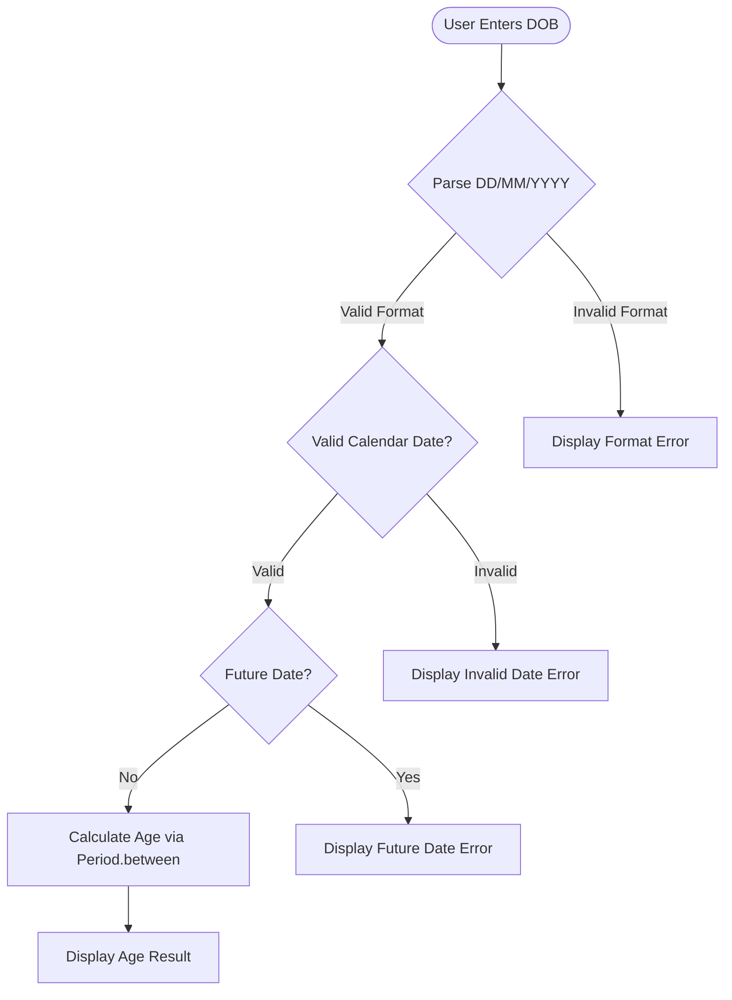

# Usage Guide

This guide explains how to use the **Age Calculator** Java console application. You will learn how to launch the application, enter your Date of Birth in the correct format, interpret the output, and handle any errors that may occur. By the end of this guide you will be comfortable running the application and understanding every response it produces.

> **Navigation:** [← Back to README](../../README.md) | [Installation Guide](installation.md)

---

## Launching the Application

Before launching, make sure the project has been compiled. If you have not compiled it yet, follow the [Installation Guide](installation.md) to install the JDK and compile the source files.

Once compiled, run the application from the **project root directory** with the following command:

```bash
java -cp src AgeCalculator
```

When the application starts, it displays an interactive prompt asking you to enter your Date of Birth:

```
Enter your Date of Birth (DD/MM/YYYY): 
```

Type your date and press **Enter** to see your calculated age.

---

## Input Format

The application expects your Date of Birth in the **DD/MM/YYYY** format. Each component must follow the rules below:

| Component | Description | Valid Range | Example |
|-----------|-------------|-------------|---------|
| `DD` | Day of the month, with a leading zero for single-digit days | `01` – `31` | `15` |
| `MM` | Month of the year, with a leading zero for single-digit months | `01` – `12` | `08` |
| `YYYY` | Four-digit year | `0001` – current year | `1998` |

The components are separated by forward slashes (`/`).

> **Technical Note:** The application uses `java.time.format.DateTimeFormatter` with the pattern `dd/MM/yyyy` to parse your input into a `java.time.LocalDate` instance.

### Valid Input Examples

| Input | Interpretation |
|-------|---------------|
| `15/08/1998` | August 15, 1998 |
| `29/02/2000` | February 29, 2000 (leap year — valid) |
| `01/01/2000` | January 1, 2000 |
| `05/11/1985` | November 5, 1985 |

### Invalid Input Examples

| Input | Problem |
|-------|---------|
| `1998-08-15` | Wrong separator — uses hyphens instead of forward slashes |
| `8/15/1998` | Wrong order — this is MM/DD/YYYY, not DD/MM/YYYY |
| `15-Aug-1998` | Wrong format — uses a month name instead of a numeric month |
| `abc/xyz/2000` | Non-numeric values where numbers are expected |
| `31/02/2020` | Invalid calendar date — February does not have 31 days |

---

## Understanding the Output

When you enter a valid Date of Birth, the application calculates your exact age and displays it in the following format:

```
Your age is X years, Y months, and Z days.
```

Here is the user-specified sample interaction:

```
Enter your Date of Birth (DD/MM/YYYY): 15/08/1998
Your age is 27 years, 6 months, and 15 days.
```

### Output Components Explained

| Component | Meaning |
|-----------|---------|
| **Years** | The number of complete years that have passed since your Date of Birth |
| **Months** | The number of additional complete months beyond the full years |
| **Days** | The number of additional days beyond the full months |

The three values together represent your precise age. For example, `27 years, 6 months, and 15 days` means 27 full years have passed, plus 6 additional months, plus 15 additional days since the Date of Birth.

> **Technical Note:** The calculation uses `java.time.Period.between()` with `java.time.LocalDate`, which accurately accounts for varying month lengths (28, 29, 30, or 31 days) and leap years. The age is computed relative to the **current system date** at the time of execution.

---

## Error Messages

The application validates your input at three stages before performing the age calculation. If validation fails at any stage, a clear error message is displayed. This section documents every error scenario.

### Invalid Date Format

- **Trigger:** The input does not match the `DD/MM/YYYY` pattern (non-numeric characters, wrong separators, or missing components).
- **Example inputs:** `abc/xyz/2000`, `1998-08-15`, `hello`
- **Error message:**

```
Error: Invalid date format. Please use DD/MM/YYYY.
```

- **Resolution:** Re-enter the date using two-digit day, two-digit month, and four-digit year separated by forward slashes. For example: `15/08/1998`.

### Invalid Calendar Date

- **Trigger:** The input matches the DD/MM/YYYY pattern but represents a date that does not exist on the calendar.
- **Example inputs:** `31/02/2020` (February does not have 31 days), `31/04/1990` (April has only 30 days)
- **Error message:**

```
Error: Invalid calendar date. The date does not exist on the calendar.
```

- **Resolution:** Verify that the day is valid for the given month and year. Pay special attention to February (28 days in common years, 29 days in leap years) and months with 30 days (April, June, September, November).

### Future Date

- **Trigger:** The entered date is after the current system date.
- **Example input:** `25/12/2030` (or any date in the future)
- **Error message:**

```
Error: Date of Birth cannot be in the future.
```

- **Resolution:** Enter a date that is on or before the current date. The application cannot calculate a meaningful age for a date that has not yet occurred.

### Error Summary Table

| Error Type | Example Input | Error Description | Resolution |
|-----------|---------------|-------------------|------------|
| Invalid Format | `abc/xyz/2000` | Input does not match the `DD/MM/YYYY` pattern | Re-enter using `DD/MM/YYYY` format |
| Invalid Calendar Date | `31/02/2020` | The date does not exist on the calendar | Verify the day is valid for the given month and year |
| Future Date | `25/12/2030` | Date of Birth cannot be in the future | Enter a past or present date |

---

## How It Works

The flowchart below illustrates the complete validation and calculation workflow that the application follows from the moment you enter your Date of Birth to the final output:



### Flowchart Steps Explained

1. **User Enters DOB** — The application prompts you and waits for input.
2. **Parse DD/MM/YYYY** — The input string is parsed using `java.time.format.DateTimeFormatter` with the pattern `dd/MM/yyyy`. If parsing fails (wrong format, non-numeric characters), a **Format Error** is displayed.
3. **Valid Calendar Date?** — The parsed date is checked to confirm it actually exists on the calendar. For example, `31/02/2020` parses structurally but February 31 does not exist, so an **Invalid Date Error** is displayed.
4. **Future Date?** — The validated date is compared against the current system date (`java.time.LocalDate.now()`). If the entered date is after today, a **Future Date Error** is displayed.
5. **Calculate Age via Period.between** — If all validations pass, `java.time.Period.between(birthDate, currentDate)` computes the exact difference in years, months, and days.
6. **Display Age Result** — The calculated age is formatted and displayed as: `Your age is X years, Y months, and Z days.`

---

## Usage Examples

This section demonstrates all five test scenarios specified for the application. Each example shows the exact console interaction you can expect.

### ✅ Normal Date of Birth

A standard date in the past with no special edge cases:

```
Enter your Date of Birth (DD/MM/YYYY): 15/08/1998
Your age is 27 years, 6 months, and 15 days.
```

The application parses the date, validates it, calculates the age using `java.time.Period.between()`, and displays the result. The exact output values depend on the current system date when you run the application.

### ✅ Leap Year Date of Birth

A Date of Birth on February 29 in a leap year:

```
Enter your Date of Birth (DD/MM/YYYY): 29/02/2000
Your age is 25 years, 11 months, and 29 days.
```

The application correctly recognizes that the year 2000 is a leap year and accepts February 29 as a valid date. The `java.time.Period` class handles leap year boundaries accurately, so the calculated age will always be correct regardless of whether the current year is a leap year or not.

> **Note:** The exact age displayed depends on the current system date at runtime. The values shown above are illustrative.

### ❌ Invalid Calendar Date

A date that does not exist on the calendar:

```
Enter your Date of Birth (DD/MM/YYYY): 31/02/2020
Error: Invalid calendar date. The date does not exist on the calendar.
```

February has at most 29 days (in a leap year) and only 28 days in a common year. The year 2020 is a leap year, but even then February only has 29 days — day 31 never exists in February. The application detects this and displays an error.

### ❌ Future Date

A date that is after the current system date:

```
Enter your Date of Birth (DD/MM/YYYY): 25/12/2030
Error: Date of Birth cannot be in the future.
```

The application compares the entered date against `java.time.LocalDate.now()`. Since December 25, 2030 has not yet occurred, the application rejects the input and asks for a valid Date of Birth.

### ❌ Wrong Format Input

An input that does not conform to the DD/MM/YYYY pattern:

```
Enter your Date of Birth (DD/MM/YYYY): hello
Error: Invalid date format. Please use DD/MM/YYYY.
```

The string `hello` cannot be parsed by `java.time.format.DateTimeFormatter` with the `dd/MM/yyyy` pattern. The application catches the parsing exception and displays a clear error message directing you to use the correct format.

---

## Tips and Best Practices

Follow these tips to get the best experience when using the Age Calculator:

- **Always use leading zeros** for single-digit days and months. Enter `01/01/2000`, not `1/1/2000`. The `DD/MM/YYYY` format requires exactly two digits for the day and month.

- **Use forward slashes (`/`) as separators.** Do not use hyphens (`-`), dots (`.`), or spaces. The parser only recognizes forward slashes.

- **Verify leap year dates before entering.** February 29 is only valid in leap years. A year is a leap year if it is divisible by 4, except for years divisible by 100 — unless also divisible by 400. For example:
  - `2000` — Leap year (divisible by 400) ✅
  - `1900` — Not a leap year (divisible by 100 but not 400) ❌
  - `2024` — Leap year (divisible by 4, not by 100) ✅

- **The age is calculated based on the current system date.** Running the application on different days will produce different results for the same Date of Birth. The application uses `java.time.LocalDate.now()` to determine today's date.

- **Double-check the day and month order.** The application uses DD/MM/YYYY (day first, then month), which differs from the MM/DD/YYYY format commonly used in some regions. Entering `08/15/1998` will cause an error because month `15` does not exist.

---

## Running Again

Each execution of the Age Calculator is independent. The application does not store any previous inputs or results. To calculate the age for a different Date of Birth, simply run the application again:

```bash
java -cp src AgeCalculator
```

You can run the application as many times as you like with different dates. Each run follows the same workflow: prompt → input → validation → calculation → output.

If you have not recompiled the project since your last change to the source code, remember to compile first:

```bash
javac src/*.java
java -cp src AgeCalculator
```

---

## Related Documentation

Explore the rest of the Age Calculator project documentation for deeper information on specific topics:

- [Installation Guide](installation.md) — JDK setup, environment variables, compilation, and troubleshooting
- [AgeCalculator API Reference](../api-reference/age-calculator.md) — Detailed Javadoc for the `AgeCalculator` class and its methods
- [DateValidator API Reference](../api-reference/date-validator.md) — Validation logic, parsing rules, and error handling details
- [Test Cases](../testing/test-cases.md) — Full test matrix with all scenarios and expected results
- [Architecture Overview](../architecture/overview.md) — Class diagrams, data flow, and design decisions
- [README](../../README.md) — Project overview and quick start
